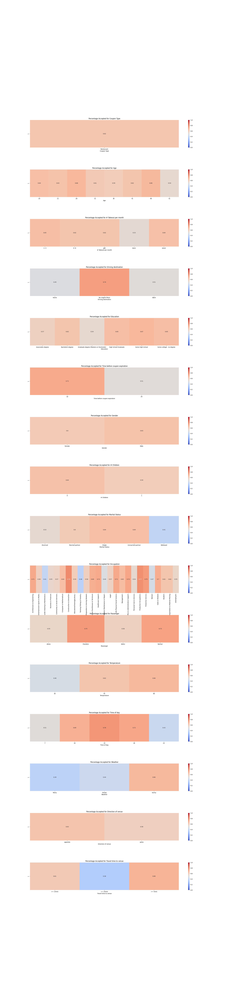
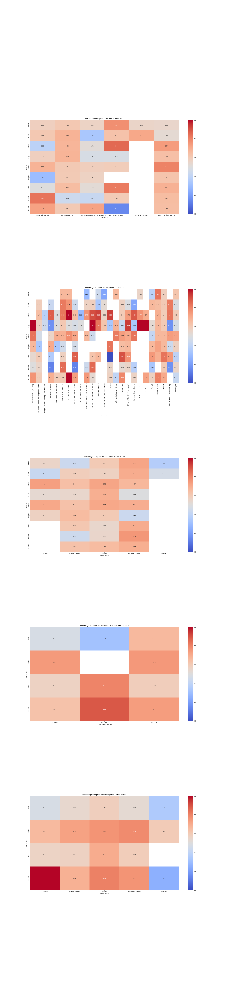
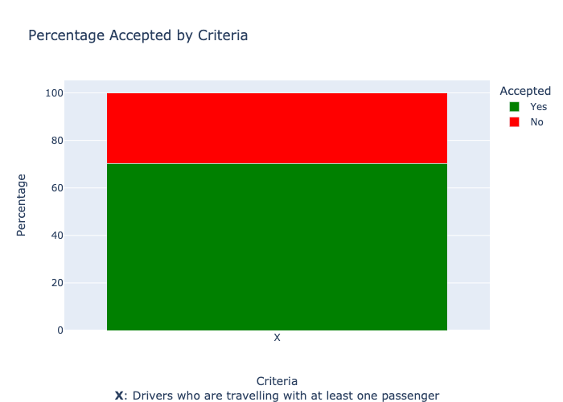
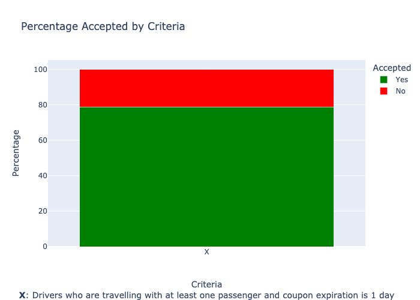
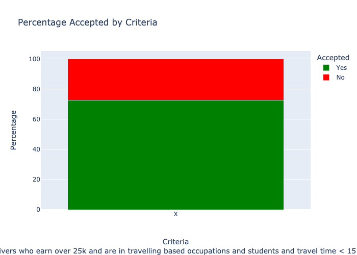
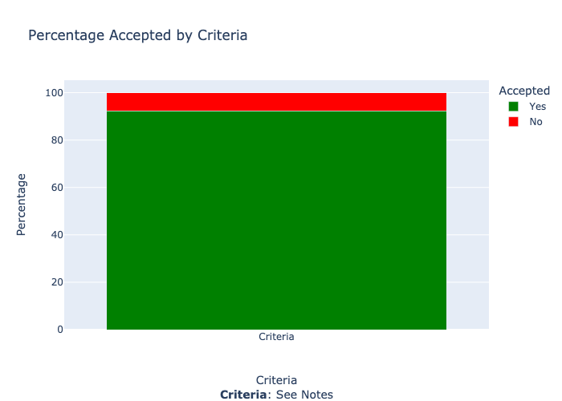

## Findings

### Overall
The acceptance rate for restaurant coupons was 62% across the data

### Analysis along single dimension
Results: 
<ul>
    <li>Looking at the acceptance rate for restaurant coupons across only one dimension at a time we find the following features have noticeable impact on acceptance rates (NOTE: I am looking at acceptance rates where the rate > 65% OR large difference in bucket values):
        <ul>
            <li>Driving destination in ['No Urgent Place'] = 74%</li>
            <li>When the driver has passengers that are not kids approximately 70+% acceptance rate</li>
            <li>Coupon expiration of 1 day has approximately 71% acceptance rate</li>
            <li>Time of day between 10 a.m. and 6 p.m. has approximately 70% acceptance rate</li>
            <li>Venue distance < 25 minutes approximately 64% acceptance rate</li>
            <li>Weather is sunny has approximately 66% acceptance rate</li>
        </ul>
    </li>
</ul>
                
### Analysis along dual dimensions
Results: 
<ul>
    <li>Education and Occupation seems to affect acceptance rate</li>
    <li>Combining multiple features from above we see:
        <ul>
            <li>Passenger vs Travel Time: If someone is in the car that is not a kid and travel time < 25 minutes people are more likley to accept the coupon typically > 60%. However if kids or a parter are in the car the driver is more willing to drive longer (80+%)</li>
            <li>Passanger vs Marital Status: Generally seems like lower acceptance rates here when the person is travelling alone or is widowed</li>
        </ul>
    </li>
</ul> 

### Bucket based analysis
Using the information gleaned above we will experiment with bucketing across multiple feature conditions.
<table>
    <tr>
        <th>Condition</th>
        <th>Analysis Result</th>
        <th>Acceptance Rate</th>
        <th>Notes</th>
    </tr>
    <tr>
        <td>Drivers who are travelling with at least one passenger</td>
        <td></td>
        <td>70.36%</td>
    </tr>
    <tr>
        <td>Drivers who are travelling with at least one passenger and coupon expiration is 1 day</td>
        <td></td>
        <td>78.83%</td>
    </tr>
    <tr>
        <td>Drivers who earn over 25k and are in travelling based occupations and students and travel time < 15 min</td>
        <td></td>
        <td>72.76</td>
    </tr>
    <tr>
        <td>Drivers who are single travelling with at least one passenger (not a kid) and income between $30k - $50k between 10 a.m. and 6 p.m.</td>
        <td></td>
        <td>92.31%</td>
        <td>Very few data points (9) so not so reliable</td>
    </tr>
</table>

### Actionable items
- Best course of action is to target passengers who are travelling with someone prefer those without kids as passengers
- Make sure the coupon is 1 day
- Prefer to send coupons to drivers that are less than 15 minutes away from venue
- Target drivers within the time range of 10 a.m. to 6 p.m.
- Prefer those with income > $25K

### Next steps
- See if we can qualify blue collar occupations vs not and see if that has an impact
- See if we can qualify travel based jobs vs not and see if that has an impact
- Need more granular times to see if we can get better targeting
- If there is a way to establish if the person is just driving around that would be great input to drive coupon acceptance