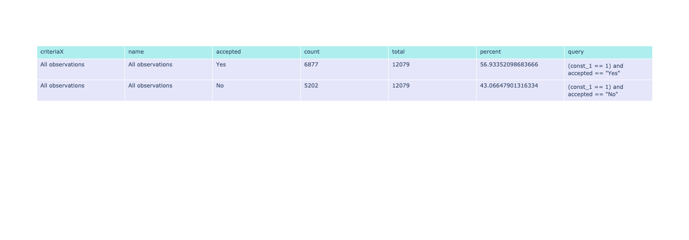
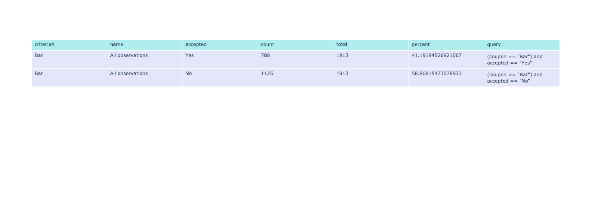
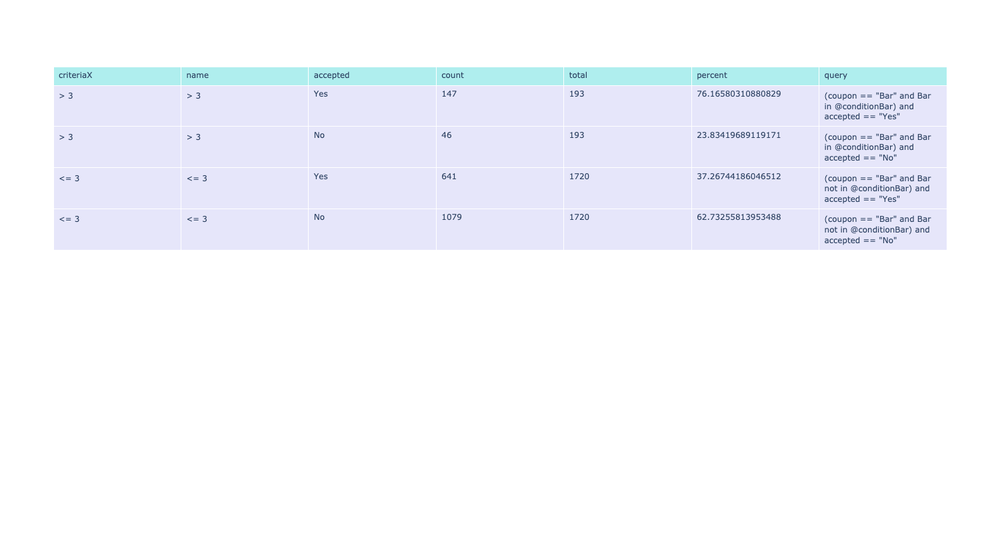
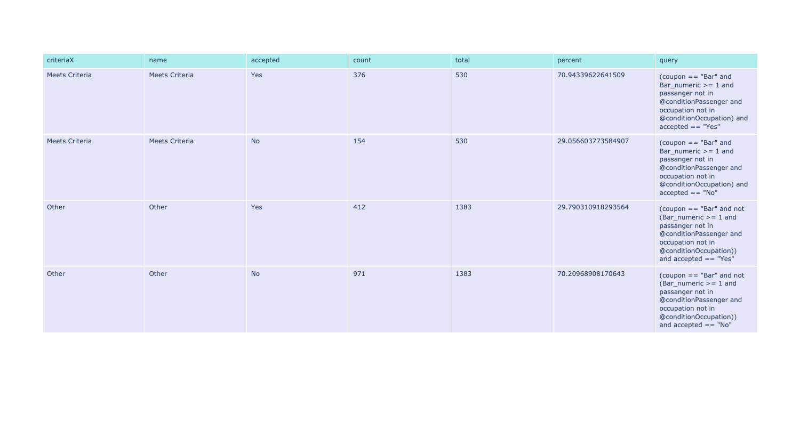
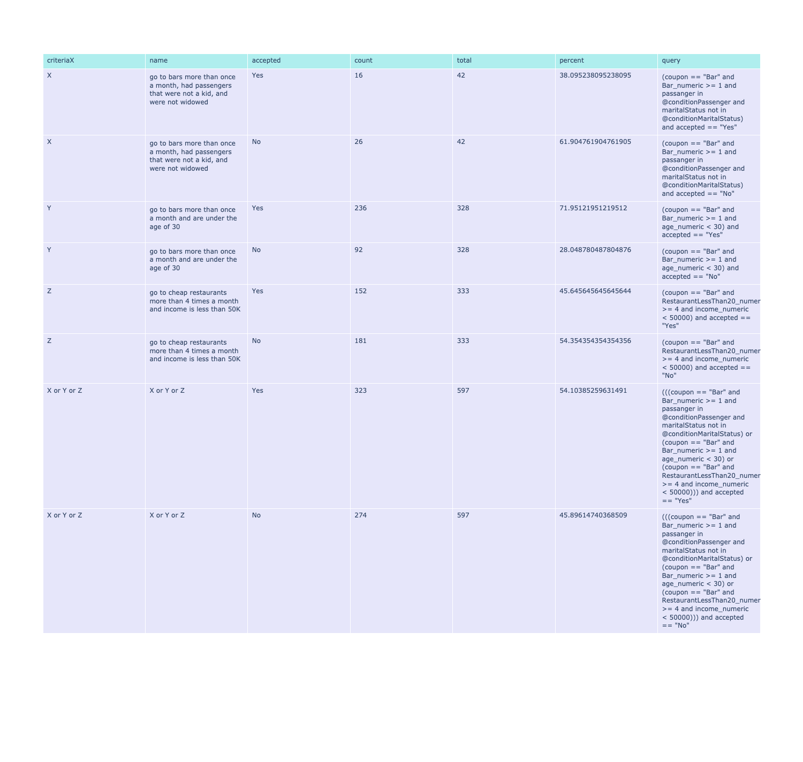

# Data Cleanup and Analysis
- Analyed the data for missing values
- Decision table below:
<table>
    <tr>
        <th>Column</th>
        <th># Missing Values</th>
        <th>Notes</th>
        <th>Plan</th>
    </tr>
    <tr>
        <td>Car</td>
        <td>12576</td>
        <td>Missing a lot of values and the ones that are there don't seem to be that useful</td>
        <td>Ignore column for anlaysis</td>
    </tr>
    <tr>
        <td>CoffeeHouse</td>
        <td>217</td>
        <td>Missing Data</td>
        <td>Remove rows where this column is empty</td>
    </tr>  
    <tr>
        <td>Restaurant20To50</td>
        <td>189</td>
        <td>Missing Data</td>
        <td>Remove rows where this column is empty</td>
    </tr>  
    <tr>
        <td>CarryAway</td>
        <td>151</td>
        <td>Missing Data</td>
        <td>Remove rows where this column is empty</td>
    </tr>    
    <tr>
        <td>RestaurantLessThan20</td>
        <td>130</td>
        <td>Missing Data</td>
        <td>Remove rows where this column is empty</td>
    </tr>
    <tr>
        <td>Bar</td>
        <td>107</td>
        <td>Missing Data</td>
        <td>Remove rows where this column is empty</td>
    </tr>
    <tr>
        <td>age, time, income</td>
        <td>0</td>
        <td>Data not amenable to correlation</td>
        <td>Create new field</td>
    </tr>  
    <tr>
        <td>Bar, CoffeeHouse, CarryAway, RestaurantLessThan20, Restaurant20To50 </td>
        <td>0</td>
        <td>Data not amenable to correlation</td>
        <td>Create new field</td>
    </tr>
    <tr>
        <td>toCoupon_GEQ5min, toCoupon_GEQ15min, toCoupon_GEQ25min, direction_same, direction_opp</td>
        <td>0</td>
        <td>Data not amenable to correlation or group by graphing</td>
        <td>Create new field/s</td>
    </tr>
</table>

Based on the calculation below I am ok with dropping all the empty rows from the dataset as I feel we have enough data points left for meaningful analysis:
    <ul>
    <li>Dropped Rows: 605</li>
    <li>Ignored Data %: 4.769788710186061</li>
    </ul>

<table>
    <tr>
        <th>Question</th>
        <td>What proportion of the total observations chose to accept the coupon?</td>
    </tr>
    <tr>
        <td colspan="2"> </td>
    </tr>
    <tr>
        <td colspan="2"> </td>
    </tr>
    <tr>
        <th>Answer</th>
        <td>Based on the analysis 56.93% of total observations chose to accept the coupon</td>
    </tr>
</table>

<table>
    <tr>
        <th>Question</th>
        <td>Use a bar plot to visualize the `coupon` column.</td>
    </tr>
    <tr>
        <td colspan="2"> </td>
    </tr>
    <tr>
        <th>Answer</th>
        <td>Based on the analysis Carry out & Take away (73.77%) and Restaurant(<20) (70.90%) have fairly high acceptance rates on the coupons</td>
    </tr>
</table>

<table>
    <tr>
        <th>Question</th>
        <td>Use a histogram to visualize the temperature column.</td>
    </tr>
    <tr>
        <td colspan="2"> </td>
    </tr>
    <tr>
        <th>Answer</th>
        <td>Based on the analysis as temperature increases there might be some correlation in acceptance rate but more analysis is needed as this feature isn't granular enough. There are wide gaps in the temperature as well.</td>
    </tr>
</table>

# Bar Coupons Analysis

<table>
    <tr>
        <th>Question</th>
        <td>What proportion of bar coupons were accepted?</td>
    </tr>
    <tr>
        <td colspan="2"> </td>
    </tr>
    <tr>
        <td colspan="2"> </td>
    </tr>
    <tr>
        <th>Answer</th>
        <td>Based on the analysis below 41.19% of Bar coupons were accepted</td>
    </tr>
</table>

<table>
    <tr>
        <th>Question</th>
        <td>Compare the acceptance rate between those who went to a bar 3 or fewer times a month to those who went more.</td>
    </tr>
    <tr>
        <td colspan="2"> </td>
    </tr>
    <tr>
        <td colspan="2"> </td>
    </tr>
    <tr>
        <th>Answer</th>
        <td>Based on the analysis below Bar coupons were accepted at approximately double the rate for people who attended a bar more than 3 times a month (76.17%) vs those that went 3 or fewer times a month (37.27%)</td>
    </tr>
</table>

<table>
    <tr>
        <th>Question</th>
        <td>Compare the acceptance rate between drivers who go to a bar more than once a month and are over the age of 25 to the all others. Is there a difference?</td>
    </tr>
    <tr>
        <td colspan="2"> </td>
    </tr>
    <tr>
        <td colspan="2"> </td>
    </tr>
    <tr>
        <th>Answer</th>
        <td>Based on the analysis below Bar coupons were accepted at approximately double the rate for people who were 25 and over and attended a bar more than once a month (68.98%) vs others (33.77%)</td>
    </tr>
</table>

<table>
    <tr>
        <th>Question</th>
        <td>Use the same process to compare the acceptance rate between drivers who go to bars more than once a month and had passengers that were not a kid and had occupations other than farming, fishing, or forestry.</td>
    </tr>
    <tr>
        <td colspan="2"> </td>
    </tr>
    <tr>
        <td colspan="2"> </td>
    </tr>
    <tr>
        <th>Answer</th>
        <td>Based on the analysis below Bar coupons were accepted at close to double rate for people go to bars more than once a month and had passengers that were not a kid and had occupations other than farming, fishing, or forestry (70.94%) vs others (29.79%)</td>
    </tr>
</table>

<table>
    <tr>
        <th>Question</th>
        <td>Compare the acceptance rates between those drivers who:
- go to bars more than once a month, had passengers that were not a kid, and were not widowed *OR*
- go to bars more than once a month and are under the age of 30 *OR*
- go to cheap restaurants more than 4 times a month and income is less than 50K. 
        </td>
    </tr>
    <tr>
        <td colspan="2"> </td>
    </tr>
    <tr>
        <td colspan="2"> </td>
    </tr>
    <tr>
        <th>Answer</th>
        <td>
            <b>Answer:</b>Based on the analysis below Bar coupons were accepted at the following rates for the criteria: 
            <b>Assumption:</b> We are still only looking at bar coupons 
            <ul>
                <li>go to bars more than once a month, had passengers that were not a kid, and were not widowed: 70.94%</li>
                <li>go to bars more than once a month and are under the age of 30: 71.95%</li>
                <li>go to cheap restaurants more than 4 times a month and income is less than 50K: 45.64%</li>
            </ul> 
            As the question is unclear grouping those criteria together yields the following results. Acceptance was double those not matching the criteria:
            <ul>
                <li>Matching ANY of those three cirteria sets: 58.71% </li>
                <li>NOT Matching ANY of those three cirteria sets: 29.99% </li>
            </ul>
        </td>
    </tr>
</table>

<table>
    <tr>
        <th>Question</th>
        <td>Based on these observations, what do you hypothesize about drivers who accepted the bar coupons?</td>
    </tr>
    <tr>
        <th>Answer</th>
        <td>
            Specifically for the previous answer:
            <ul>
                <li>I hypothesize people that attend a bar at least once a month are more likley to accept coupons because they frequent bars and were likely to go anyway so the coupon may be a motivator to get a discount, additionally being without kids as passengers meant they didn't have to account for finding car for the kids or likely may not have kids in general</li>
                <li>people that were young and already going to bars at least once a month were more likely to accept the coupon possibly because they were less likely to have kids, given they went to bars once a month anyways coupled with the age I hypothesize they probaly also are more likely to be driving around with nothing to do and have a lot of time flexibility</li>
                <li>For people attending cheap resteraunts with lower income I hypothesize that they are trying to save money and are probably less likely to go to bars on a whim and so less likely to accept the coupons</li>
            </ul>
            More generally based solely on the analysis above:
            <ul>
                <li>I hypothesize that people that already attend a bar at least once a month are much more likley to accept bar coupons</li>
                <li>I hypothesize that having no kids also makes it likely to accept the coupon</li>
                <li>I hypothesize that age typically below thirty are more likely to accept the coupon possibly because of fewer commitments related to kids and more free time</li>
            </ul>
        </td>
    </tr>
</table>

# Restaurant Coupons Analysis

## Findings

### Overall
The acceptance rate for restaurant coupons was 62% across the data

### Analysis along single dimension
Results: 
<ul>
    <li>Looking at the acceptance rate for restaurant coupons across only one dimension at a time we find the following features have noticeable impact on acceptance rates (NOTE: I am looking at acceptance rates where the rate > 65% OR large difference in bucket values):
        <ul>
            <li>Driving destination in ['No Urgent Place'] = 74%</li>
            <li>When the driver has passengers that are not kids approximately 70+% acceptance rate</li>
            <li>Coupon expiration of 1 day has approximately 71% acceptance rate</li>
            <li>Time of day between 10 a.m. and 6 p.m. has approximately 70% acceptance rate</li>
            <li>Venue distance < 25 minutes approximately 64% acceptance rate</li>
            <li>Weather is sunny has approximately 66% acceptance rate</li>
        </ul>
    </li>
</ul>
                
### Analysis along dual dimensions
Results: 
<ul>
    <li>Education and Occupation seems to affect acceptance rate</li>
    <li>Combining multiple features from above we see:
        <ul>
            <li>Passenger vs Travel Time: If someone is in the car that is not a kid and travel time < 25 minutes people are more likley to accept the coupon typically > 60%. However if kids or a parter are in the car the driver is more willing to drive longer (80+%)</li>
            <li>Passanger vs Marital Status: Generally seems like lower acceptance rates here when the person is travelling alone or is widowed</li>
        </ul>
    </li>
</ul> 

### Bucket based analysis
Using the information gleaned above we will experiment with bucketing across multiple feature conditions.

<table>
    <tr>
        <td colspan="3"></td>
    </tr>
    <tr>
        <td colspan="3"></td>
    </tr>
    <tr>
        <th>Condition</th>
        <th>Acceptance Rate</th>
        <th>Notes</th>
    </tr>
    <tr>
        <td>Drivers who are travelling with at least one passenger</td>
        <td>70.36%</td>
    </tr>
    <tr>
        <td>Drivers who are travelling with at least one passenger and coupon expiration is 1 day</td>
        <td>78.83%</td>
    </tr>
    <tr>
        <td>Drivers who earn over 25k and are in travelling based occupations and students and travel time < 15 min</td>
        <td>72.76</td>
    </tr>
    <tr>
        <td>Drivers who are single travelling with at least one passenger (not a kid) and income between $30k - $50k between 10 a.m. and 6 p.m</td>
        <td>92.31%</td>
        <td>Very few data points so not so reliable</td>
    </tr>
</table>

### Actionable items
- Best course of action is to target passengers who are travelling with someone prefer those without kids as passengers
- Make sure the coupon is 1 day
- Prefer to send coupons to drivers that are less than 15 minutes away from venue
- Target drivers within the time range of 10 a.m. to 6 p.m.
- Prefer those with income > $25K

### Next steps
- See if we can qualify blue collar occupations vs not and see if that has an impact
- See if we can qualify travel based jobs vs not and see if that has an impact
- Need more granular times to see if we can get better targeting
- If there is a way to establish if the person is just driving around that would be great input to drive coupon acceptance
