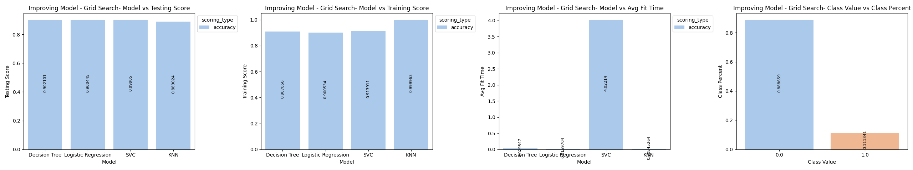

# Practical Application III: Comparing Classifiers
<b color="red">NOTE: All images are clickable and higher resolution images will load in new browser window</b>
## Background
We are trying to analyze the results of a Portugese Bank marketing campaign conducted over phone.
 The goal of the campaign was to get a customer to sign up for a term deposit.
The dataset collected is related to 17 campaigns that occurred between May 2008 and November 2010, corresponding to a total of 79354 contacts

We will follow the CRISP-DM process model consisting of Business Understanding, Data Understanding, Data Preparation, Modeling, Evaluation, Deployment stages.
## CRISP DM: Data Understanding
### Data Shape
The data has the following information
```
<class 'pandas.core.frame.DataFrame'>
RangeIndex: 41188 entries, 0 to 41187
Data columns (total 21 columns):
 #   Column          Non-Null Count  Dtype  
---  ------          --------------  -----  
 0   age             41188 non-null  int64  
 1   job             41188 non-null  object 
 2   marital         41188 non-null  object 
 3   education       41188 non-null  object 
 4   default         41188 non-null  object 
 5   housing         41188 non-null  object 
 6   loan            41188 non-null  object 
 7   contact         41188 non-null  object 
 8   month           41188 non-null  object 
 9   day_of_week     41188 non-null  object 
 10  duration        41188 non-null  int64  
 11  campaign        41188 non-null  int64  
 12  pdays           41188 non-null  int64  
 13  previous        41188 non-null  int64  
 14  poutcome        41188 non-null  object 
 15  emp.var.rate    41188 non-null  float64
 16  cons.price.idx  41188 non-null  float64
 17  cons.conf.idx   41188 non-null  float64
 18  euribor3m       41188 non-null  float64
 19  nr.employed     41188 non-null  float64
 20  y               41188 non-null  object 
dtypes: float64(5), int64(5), object(11)
memory usage: 6.6+ MB

```
### Features
```
Input variables:
# bank client data:
1 - age (numeric)
2 - job : type of job (categorical: 'admin.','blue-collar','entrepreneur','housemaid','management','retired','self-employed','services','student','technician','unemployed','unknown')
3 - marital : marital status (categorical: 'divorced','married','single','unknown'; note: 'divorced' means divorced or widowed)
4 - education (categorical: 'basic.4y','basic.6y','basic.9y','high.school','illiterate','professional.course','university.degree','unknown')
5 - default: has credit in default? (categorical: 'no','yes','unknown')
6 - housing: has housing loan? (categorical: 'no','yes','unknown')
7 - loan: has personal loan? (categorical: 'no','yes','unknown')
# related with the last contact of the current campaign:
8 - contact: contact communication type (categorical: 'cellular','telephone')
9 - month: last contact month of year (categorical: 'jan', 'feb', 'mar', ..., 'nov', 'dec')
10 - day_of_week: last contact day of the week (categorical: 'mon','tue','wed','thu','fri')
11 - duration: last contact duration, in seconds (numeric). Important note: this attribute highly affects the output target (e.g., if duration=0 then y='no'). Yet, the duration is not known before a call is performed. Also, after the end of the call y is obviously known. Thus, this input should only be included for benchmark purposes and should be discarded if the intention is to have a realistic predictive model.
# other attributes:
12 - campaign: number of contacts performed during this campaign and for this client (numeric, includes last contact)
13 - pdays: number of days that passed by after the client was last contacted from a previous campaign (numeric; 999 means client was not previously contacted)
14 - previous: number of contacts performed before this campaign and for this client (numeric)
15 - poutcome: outcome of the previous marketing campaign (categorical: 'failure','nonexistent','success')
# social and economic context attributes
16 - emp.var.rate: employment variation rate - quarterly indicator (numeric)
17 - cons.price.idx: consumer price index - monthly indicator (numeric)
18 - cons.conf.idx: consumer confidence index - monthly indicator (numeric)
19 - euribor3m: euribor 3 month rate - daily indicator (numeric)
20 - nr.employed: number of employees - quarterly indicator (numeric)
Output variable (desired target):
21 - y - has the client subscribed a term deposit? (binary: 'yes','no')

```
#### Analysis
Data has no missing values so we will examine content as based on the infromation it seems like empty values have been substituted
#### Data Distributions
<a href="./analysis_results/module_17_01.step03.data_understanding.categorical.data.distribution.png" target="_blank"></a>

<a href="./analysis_results/module_17_01.step03.data_understanding.numeric.data.distribution.png" target="_blank"></a>

#### Decisions
| Column | Notes | Decision |
| ------ | ----- | -------- |
| pdays | Majority of values are 999 | Drop column |
| job, marital, education, housing, loan | Unknown values account for small percentage of dataset | Drop rows |
| poutcome  | non-existent values account for large percentage and doesn't add value  | Drop column |
| default  | most are no or unknown and doesn't add value | Drop column |
| duration  | Per the information we should drop this column as it is not known at the time the prediction needs to be made. We can use it for benchmarking | Keep column but drop before finalizing final model |
| nr.employed  | This has no bearing on whether a customer will sign up as it doesn't represent information the customer would have for their decision | Drop column |
## CRISP DM: Business Understanding
### Business Objective
Our goal is to:
- First find a model that best predicts whether a user will sign up for a long term deposit after several contacts from a marketing campaign.
- Second use the model to explain what features contribute most significantly to the outcome of user signing up for a deposit.
- Lastly use this information to offer guidance to the bank on which customers to target based on features or approach so we can minimize resources, time and thus cost and maximize the desired result.
## CRISP DM: Data Preparations
### Feature Engineering Decisions
We are asked to focus on just the "bank client data" features. In order to simplify later steps though we will also make some decisions around the "other attributes" and "social and economic context attributes" features to be efficent in our data preparation.
| Fields | Operation | Notes |
| ------ | ----- | -------- |
| [] | Drop duplicates |  |
| ['poutcome', 'default', 'pdays', 'nr.employed'] | Drop columns |  |
| [] | Filter rows | Query: job != "unknown" & marital != "unknown" & education != "unknown" & housing != "unknown" & loan != "unknown" |
| ['ALL CATEGORICAL'] | One hot encode | All categorical columns with < 255 unique values |
| ['ALL CATEGORICAL'] | Drop |  |
| ['y_yes'] | rename | rename to y |
### Data Distributions
<a href="./analysis_results/module_17_01.step05.engineering_features.categorical.data.distribution.png" target="_blank"></a>

<a href="./analysis_results/module_17_01.step05.engineering_features.numeric.data.distribution.png" target="_blank"></a>

### Data Composition Change Tracking
<a href="./analysis_results/module_17_01.step05.engineering_features.unique_values.png" target="_blank"></a>

### Train/Test Split
We will use the traditional split of 70% train / 30% split
## CRISP DM: Modeling
- We will use the accuracy of the test score to evaluate the models against each other and select best model during Grid Search.
- However if the bank had an opinon for example one of the ones below we would adjust the scoring type.
  - Recall: If we wanted to make sure we didn't miss any customers that may sign up we would optimize for recall.
  - Precision: If we wanted to make sure we only spend time contacting customers that are likely sign up we would optimize for precision.
### Baseline Model
#### Confusion Matrix
<a href="./analysis_results/module_17_01.step07.baseline_model.confusion_matrix.png" target="_blank"></a>

#### Performance Metrics (Tables)
<a href="./analysis_results/module_17_01.step07.baseline_model.model_comparison_report.dataFrame.png" target="_blank"></a>

#### Analysis
The Baseline (DummyClassifier) has an accuracy test score of 88.61476767500653%
#### Confusion Matrix
<a href="./analysis_results/module_17_01.step08.simple_model.confusion_matrix.png" target="_blank"></a>

#### Performance Metrics (Tables)
<a href="./analysis_results/module_17_01.step08.simple_model.model_comparison_report.dataFrame.png" target="_blank"></a>

#### Analysis
The Logistic Regression has an accuracy test score of 90.8116118908552% which is better than our baseline score of 88.61476767500653%.
### Multiple Default Model Comparisons
Comparing mutlipel models using default hyperparameters/settings we find.
#### Confusion Matrix
<a href="./analysis_results/module_17_01.step10.model_comparison.confusion_matrix.png" target="_blank"></a>

#### Performance Metrics (Tables)
<a href="./analysis_results/module_17_01.step10.model_comparison.model_comparison_report.dataFrame.png" target="_blank"></a>

#### Performance Metrics (Visualized)
<a href="./analysis_results/module_17_01.step10.model_comparison.model_comparison_graphs.png" target="_blank"></a>

#### Analysis
- The best performing model is Logistic Regression with a score of 90.8116118908552% which is better than our baseline score of 88.61476767500653%.
- The worst performing model is Decision Tree with a score of 88.61476767500653% which is worse than our baseline score of 88.61476767500653%.
- The fastest performing model is KNN with a score of 89.03321419231105% which is better than our baseline score of 88.61476767500653%.
- The slowest performing model is SVC with a score of 90.5413651817627% which is better than our baseline score of 88.61476767500653%.

### Grid Search - Only Bank Client Data
Experiment using bank client data features including duration
#### Confusion Matrix
<a href="./analysis_results/module_17_01.step11.improving_model.experiment1.confusion_matrix.png" target="_blank"></a>

#### Performance Metrics (Tables)
<a href="./analysis_results/module_17_01.step11.improving_model.experiment1.model_comparison_report.dataFrame.png" target="_blank"></a>

#### Performance Metrics (Visualized)
<a href="./analysis_results/module_17_01.step11.improving_model.experiment1.model_comparison_graphs.png" target="_blank"></a>

#### Analysis
- The best performing model is Decision Tree with a score of 90.21009502222998% which is better than our baseline score of 88.61476767500653%.
- The worst performing model is KNN with a score of 88.90244965565338% which is better than our baseline score of 88.61476767500653%.
- The fastest performing model is KNN with a score of 88.90244965565338% which is better than our baseline score of 88.61476767500653%.
- The slowest performing model is SVC with a score of 89.90497777002876% which is better than our baseline score of 88.61476767500653%.

### Grid Search - Bank Client Data + Other
Experiment using bank client data features, other features including duration
#### Confusion Matrix
<a href="./analysis_results/module_17_01.step11.improving_model.experiment2.confusion_matrix.png" target="_blank"></a>

#### Performance Metrics (Tables)
<a href="./analysis_results/module_17_01.step11.improving_model.experiment2.model_comparison_report.dataFrame.png" target="_blank"></a>

#### Performance Metrics (Visualized)
<a href="./analysis_results/module_17_01.step11.improving_model.experiment2.model_comparison_graphs.png" target="_blank"></a>

#### Analysis
- The best performing model is Logistic Regression with a score of 90.27111847267021% which is better than our baseline score of 88.61476767500653%.
- The worst performing model is KNN with a score of 88.87629674832186% which is better than our baseline score of 88.61476767500653%.
- The fastest performing model is KNN with a score of 88.87629674832186% which is better than our baseline score of 88.61476767500653%.
- The slowest performing model is SVC with a score of 90.1229186644582% which is better than our baseline score of 88.61476767500653%.

### Grid Search - Bank Client Data + Other + Social and Economic
Experiment using bank client data features, other features, social and economic features including duration
#### Confusion Matrix
<a href="./analysis_results/module_17_01.step11.improving_model.experiment3.confusion_matrix.png" target="_blank"></a>

#### Performance Metrics (Tables)
<a href="./analysis_results/module_17_01.step11.improving_model.experiment3.model_comparison_report.dataFrame.png" target="_blank"></a>

#### Performance Metrics (Visualized)
<a href="./analysis_results/module_17_01.step11.improving_model.experiment3.model_comparison_graphs.png" target="_blank"></a>

#### Analysis
- The best performing model is Decision Tree with a score of 91.39569348792608% which is better than our baseline score of 88.61476767500653%.
- The worst performing model is KNN with a score of 89.02449655653388% which is better than our baseline score of 88.61476767500653%.
- The fastest performing model is KNN with a score of 89.02449655653388% which is better than our baseline score of 88.61476767500653%.
- The slowest performing model is SVC with a score of 90.5413651817627% which is better than our baseline score of 88.61476767500653%.

### Grid Search - Bank Client Data + Other + Social and Economic without Duraton
Experiment using all features except duration.
As part of the data description above we are told:
```
duration: last contact duration, in seconds (numeric). Important note: this attribute highly affects the output target (e.g., if duration=0 then y="no"). Yet, the duration is not known before a call is performed. Also, after the end of the call y is obviously known. Thus, this input should only be included for benchmark purposes and should be discarded if the intention is to have a realistic predictive model
```

#### Confusion Matrix
<a href="./analysis_results/module_17_01.step11.improving_model.experiment4.confusion_matrix.png" target="_blank"></a>

#### Performance Metrics (Tables)
<a href="./analysis_results/module_17_01.step11.improving_model.experiment4.model_comparison_report.dataFrame.png" target="_blank"></a>

#### Performance Metrics (Visualized)
<a href="./analysis_results/module_17_01.step11.improving_model.experiment4.model_comparison_graphs.png" target="_blank"></a>

#### Analysis
- The best performing model is Decision Tree with a score of 89.30346090140354% which is better than our baseline score of 88.61476767500653%.
- The worst performing model is KNN with a score of 88.68450876122395% which is better than our baseline score of 88.61476767500653%.
- The fastest performing model is KNN with a score of 88.68450876122395% which is better than our baseline score of 88.61476767500653%.
- The slowest performing model is SVC with a score of 89.25115508674047% which is better than our baseline score of 88.61476767500653%.

## CRISP DM: Evaluation
Using a "voting" approach where each time a feature is deemed important by a model it increments the vote. Coefficents are including to evaluate direction and magnitude as well.
### Only Bank Client Data
#### Feature Importance

Important features using voting approach:

['duration', 'month', 'contact', 'job', 'age']

The specific values of these important features are:
<a href="./analysis_results/module_17_01.step11.improving_model.experiment1.important_features.dataFrame.png" target="_blank"></a>

#### Decision Tree
The descision tree is more easily interpretable/explainable to help with the understanding how the model works and can help the bank make decisions about optimizing the campaign.
<a href="./analysis_results/module_17_01.step12.final_analysis..decision_tree_final.png" target="_blank"></a>
### Bank Client Data + Other
#### Feature Importance

Important features using voting approach:

['duration', 'previous', 'month', 'contact', 'job', 'age', 'campaign']

The specific values of these important features are:
<a href="./analysis_results/module_17_01.step11.improving_model.experiment2.important_features.dataFrame.png" target="_blank"></a>

#### Decision Tree
The descision tree is more easily interpretable/explainable to help with the understanding how the model works and can help the bank make decisions about optimizing the campaign.
<a href="./analysis_results/module_17_01.step12.final_analysis..decision_tree_final.png" target="_blank"></a>
### Bank Client Data + Other + Social and Economic
#### Feature Importance

Important features using voting approach:

['duration', 'euribor3m', 'emp.var.rate', 'cons.price.idx', 'month', 'cons.conf.idx', 'contact']

The specific values of these important features are:
<a href="./analysis_results/module_17_01.step11.improving_model.experiment3.important_features.dataFrame.png" target="_blank"></a>

#### Decision Tree
The descision tree is more easily interpretable/explainable to help with the understanding how the model works and can help the bank make decisions about optimizing the campaign.
<a href="./analysis_results/module_17_01.step12.final_analysis..decision_tree_final.png" target="_blank"></a>
### Bank Client Data + Other + Social and Economic without Duraton
#### Feature Importance

Important features using voting approach:

['euribor3m', 'month', 'emp.var.rate', 'cons.price.idx', 'contact']

The specific values of these important features are:
<a href="./analysis_results/module_17_01.step11.improving_model.experiment4.important_features.dataFrame.png" target="_blank"></a>

#### Analysis
#### Data Distributions
**NOTE:** Important features highlighted using different palette
<a href="./analysis_results/module_17_01.step12.final_analysis.important.categorical.data.distribution.png" target="_blank"></a>
<a href="./analysis_results/module_17_01.step12.final_analysis.important.age.data.distribution.png" target="_blank"></a>

<a href="./analysis_results/module_17_01.step12.final_analysis.important.numeric.data.distribution.png" target="_blank"></a>

#### Decision Tree
The descision tree is more easily interpretable/explainable to help with the understanding how the model works and can help the bank make decisions about optimizing the campaign.
<a href="./analysis_results/module_17_01.step12.final_analysis..decision_tree_final.png" target="_blank"></a>
## Next Steps: Summary, Observations and Guidance
### Summary
#### Model Observations and Guidance
- Our Baseline score: 88.61477%
- Model Analysis:
    - Observation: SVC always performs significantly slower that the other models.
    - Guidance: For very large sets where compute resources are an issue during training we may stay away from SVM model.

#### Experiment - Best Model and Hyperparameters
<table>
<tr><th>Experiment</th><th>Best Model</th><th>Best Parameters</th><th>Accuracy Test Score</th><th>Better Then Baseline</th><th>Important Features</th></tr>
<tr><td>Only Bank Client Data</td><td>Decision Tree</th><td>{"criterion": "gini", "max_depth": 6}</td><td>90.21%</td><td>&#10003;</td><td>['duration', 'month_oct', 'month_mar', 'month_sep', 'contact_telephone', 'month_jun', 'job_retired', 'job_student', 'month_apr', 'age', 'month_may', 'month_jul']</td></tr>
<tr><td>Bank Client Data + Other</td><td>Logistic Regression</th><td>{"C": 0.5, "penalty": "l2"}</td><td>90.271%</td><td>&#10003;</td><td>['duration', 'previous', 'month_mar', 'month_jun', 'month_oct', 'month_may', 'contact_telephone', 'month_sep', 'job_retired', 'age', 'month_jul', 'campaign']</td></tr>
<tr><td>Bank Client Data + Other + Social and Economic</td><td>Decision Tree</th><td>{"criterion": "gini", "max_depth": 5}</td><td>91.396%</td><td>&#10003;</td><td>['duration', 'euribor3m', 'emp.var.rate', 'cons.price.idx', 'month_aug', 'month_mar', 'cons.conf.idx', 'month_may', 'contact_telephone']</td></tr>
<tr><td>Bank Client Data + Other + Social and Economic without Duraton</td><td>Decision Tree</th><td>{"criterion": "entropy", "max_depth": 4}</td><td>89.303%</td><td>&#10003;</td><td>['euribor3m', 'month_may', 'emp.var.rate', 'cons.price.idx', 'month_aug', 'month_mar', 'month_oct', 'contact_telephone']</td></tr>
</table>

#### Experiment - Best Model Identified Important Features
<table>
<tr><th>Experiment</th><th>Feature</th><th>Value</th><th>Direction</th><th>Magnitude</th></tr>
<tr><td rowspan="12">Only Bank Client Data</td><td rowspan="1">duration</td><td>{numeric}</td><td>&#8679;</td><td>1.082065225991913</td></tr>
<tr><td rowspan="7">month</td><td>oct</td><td>&#8679;</td><td>0.2597318671004503</td></tr>
<tr><td>mar</td><td>&#8679;</td><td>0.2467861039284352</td></tr>
<tr><td>sep</td><td>&#8679;</td><td>0.2085821156741267</td></tr>
<tr><td>jun</td><td>&#8679;</td><td>0.2542701337694369</td></tr>
<tr><td>apr</td><td>&#8679;</td><td>0.1249406698223257</td></tr>
<tr><td>may</td><td>&#8681;</td><td>-0.1378830404548846</td></tr>
<tr><td>jul</td><td>&#8681;</td><td>-0.2095832463104147</td></tr>
<tr><td rowspan="1">contact</td><td>telephone</td><td>&#8681;</td><td>-0.6541237717780517</td></tr>
<tr><td rowspan="2">job</td><td>retired</td><td>&#8679;</td><td>0.1614365833860295</td></tr>
<tr><td>student</td><td>&#8679;</td><td>0.1286211383072974</td></tr>
<tr><td rowspan="1">age</td><td>{numeric}</td><td>&#8660;</td><td>0.0</td></tr>
<tr><td rowspan="12">Bank Client Data + Other</td><td rowspan="1">duration</td><td>{numeric}</td><td>&#8679;</td><td>1.104149326657083</td></tr>
<tr><td rowspan="1">previous</td><td>{numeric}</td><td>&#8679;</td><td>0.3369958059719511</td></tr>
<tr><td rowspan="6">month</td><td>mar</td><td>&#8679;</td><td>0.2454181716555552</td></tr>
<tr><td>jun</td><td>&#8679;</td><td>0.2344384808953174</td></tr>
<tr><td>oct</td><td>&#8679;</td><td>0.2244024990160292</td></tr>
<tr><td>may</td><td>&#8681;</td><td>-0.1743437365532584</td></tr>
<tr><td>sep</td><td>&#8679;</td><td>0.1685180647782279</td></tr>
<tr><td>jul</td><td>&#8681;</td><td>-0.1364814517318962</td></tr>
<tr><td rowspan="1">contact</td><td>telephone</td><td>&#8681;</td><td>-0.5202334991847558</td></tr>
<tr><td rowspan="1">job</td><td>retired</td><td>&#8679;</td><td>0.156342723032508</td></tr>
<tr><td rowspan="1">age</td><td>{numeric}</td><td>&#8660;</td><td>0.0</td></tr>
<tr><td rowspan="1">campaign</td><td>{numeric}</td><td>&#8681;</td><td>-0.1973018290559664</td></tr>
<tr><td rowspan="9">Bank Client Data + Other + Social and Economic</td><td rowspan="1">duration</td><td>{numeric}</td><td>&#8679;</td><td>1.210274424952014</td></tr>
<tr><td rowspan="1">euribor3m</td><td>{numeric}</td><td>&#8679;</td><td>0.8228518845810416</td></tr>
<tr><td rowspan="1">emp.var.rate</td><td>{numeric}</td><td>&#8681;</td><td>-2.559176244839346</td></tr>
<tr><td rowspan="1">cons.price.idx</td><td>{numeric}</td><td>&#8679;</td><td>1.111251477481114</td></tr>
<tr><td rowspan="3">month</td><td>aug</td><td>&#8679;</td><td>0.3185617297972314</td></tr>
<tr><td>mar</td><td>&#8679;</td><td>0.2194420460606971</td></tr>
<tr><td>may</td><td>&#8681;</td><td>-0.2236741086069774</td></tr>
<tr><td rowspan="1">cons.conf.idx</td><td>{numeric}</td><td>&#8660;</td><td>0.0</td></tr>
<tr><td rowspan="1">contact</td><td>telephone</td><td>&#8681;</td><td>-0.2891967435805612</td></tr>
<tr><td rowspan="8">Bank Client Data + Other + Social and Economic without Duraton</td><td rowspan="1">euribor3m</td><td>{numeric}</td><td>&#8679;</td><td>0.7917080369434308</td></tr>
<tr><td rowspan="4">month</td><td>may</td><td>&#8681;</td><td>-0.1550229162754021</td></tr>
<tr><td>aug</td><td>&#8679;</td><td>0.215160737771222</td></tr>
<tr><td>mar</td><td>&#8679;</td><td>0.173054322801111</td></tr>
<tr><td>oct</td><td>&#8660;</td><td>0.0</td></tr>
<tr><td rowspan="1">emp.var.rate</td><td>{numeric}</td><td>&#8681;</td><td>-2.215338393324382</td></tr>
<tr><td rowspan="1">cons.price.idx</td><td>{numeric}</td><td>&#8679;</td><td>1.063061961973605</td></tr>
<tr><td rowspan="1">contact</td><td>telephone</td><td>&#8681;</td><td>-0.3602929094747224</td></tr>
</table>

### Guidance
- Even though the models identify important features we select some additional ones based on the data we have that show higher chance of success.

<table>

<tr><th>Feature</th><th>Observation</th><th>Guidance</th></tr>
<tr><td>month</td><td>Certain months show better success than others e.g. March and months towards end of year.</td><td>Maybe ramp down the calls to save on cost during the down months or increase calls during peak months.</td></tr>
<tr><td>age</td><td>Ages above 60 and below have better success however have smaller numbers. There is a bracket between 30-35 with more success.</td><td>Target customers in the brackets 30-35 and above 60.</td></tr>
<tr><td>job</td><td>Middle class, students and retired folks more success.</td><td>Target customers in the middle class jobs (particularly admin and technicians), retired people and students.</td></tr>
<tr><td>duration</td><td>Durations of around 300 seconds appear to be more successful. Though this may just be a function of customers who were going to accept and having longer discussions.</td><td>Plan on your agents spending at least 300 seconds to talk to customers. This is more of a staffing suggestion based on how many callouts.</td></tr>
<tr><td>campaign</td><td>Seems like we have some success reaching out between 1-4 times.</td><td>Don't bother calling customers more than 4 times.</td></tr>
<tr><td>cons.conf.idx</td><td>These the bank has no control over this but it affects success.</td><td>Adjust agent resources up/down based on this indicator.</td></tr>
<tr><td>cons.price.idx</td><td>These the bank has no control over this but it affects success.</td><td>Adjust agent resources up/down based on this indicator.</td></tr>
<tr><td>emp.var.rate</td><td>These the bank has no control over this but it affects success.</td><td>Adjust agent resources up/down based on this indicator.</td></tr>
<tr><td>euribor3m</td><td>These the bank has no control over this but it affects success.</td><td>Adjust agent resources up/down based on this indicator.</td></tr>
</table>

##### Runtime Metrics:
```
{
  "Problem 3 Execution Time": 2.959447833010927,
  "Problem 5 Execution Time": 2.692959666950628,
  "Problem 9 Execution Time": 0.3006500001065433,
  "Problem 10 Execution Time": 21.996551707852632,
  "Problem 11 Execution Time": 11355.597503457917,
  "Problem 12 Execution Time": 10.982656332897022,
  "start_time": "2024-10-27 00:41:30.741289",
  "end_time": "2024-10-27 03:51:28.875164",
  "total_execution_time": 11398.011297417106
}
```
