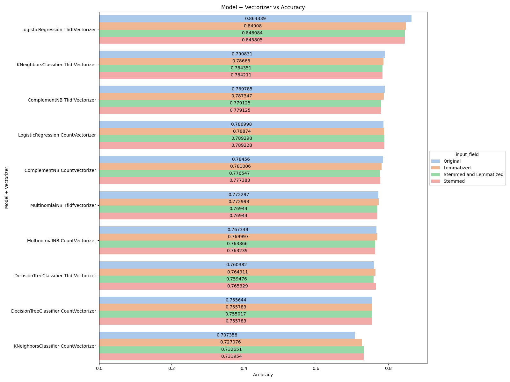
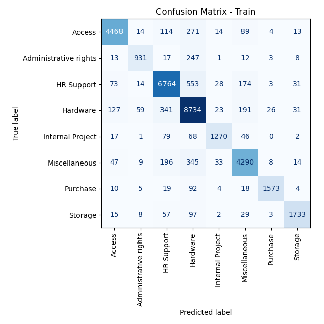
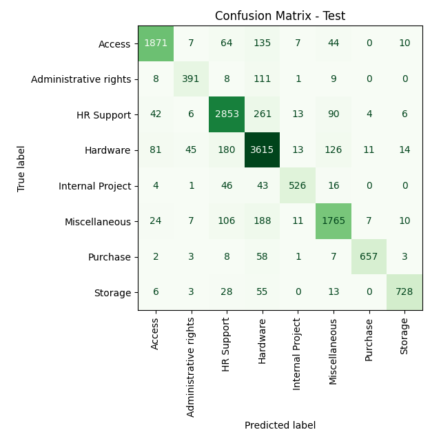

# Capstone: IT Service Ticket Classification
<b color="red">NOTE: All images are clickable and higher resolution images will load in new browser window</b>
## Background
Most companies have a service desk to help their user or customers with their IT problems.
Customers log and track their ticket in some digital platform and these get routed to Agents to solve.
Routing these tickets to the correct person/team to solve is very important:
- A common approach is to "tag" the ticket with some classification and there is a mapping that routes based on the tag to the correct team to solve it.
- Tickets incorrectly classified result in them "bouncing around" and wasting both agents and customer time.
- There is a financial impact resulting in wasted internal resources and lower customer satisfaction costing the company in real world dollars as well as reputation.
- The scale of the problem grows as you service more users as you need more and more agents to help.


This project aims to address this task by finding and building a model to aid in the classification of these tickets into appropriate categories. We will experiment with various types of pre-processing, vectorizers and regression models to help us find the best one to solve for this.

**Dataset**: [IT Service Ticket Classification Dataset](https://www.kaggle.com/datasets/adisongoh/it-service-ticket-classification-dataset)
- This dataset contains 47,837 rows of data and 2 features.

We will follow the CRISP-DM process model consisting of Business Understanding, Data Understanding, Data Preparation, Modeling, Evaluation, Deployment stages.


## Research Code
**Code:** [Data Analysis Workbook](./capstone.out.ipynb)

**NOTE:** *The processing of the juypter notebook take a long time and often disconnects from the session. In order to run it without monitoring it all the time use the wokraround below from command line.*
```
jupyter nbconvert --to notebook --execute {input_notebook} --output={output_notebook} --ExecutePreprocessor.timeout=-1
```
<sub>Source: [screen-and-jupyter-a-way-to-run-long-notebooks-headles](https://www.maksimeren.com/post/screen-and-jupyter-a-way-to-run-long-notebooks-headless/)</sub>


## Business Understanding
Our goal is to:
- Come up with the best classification model to correctly classify the tickets based solely on the description.
- Provide the business with the best model and hyperparameters to drive the best accuracy.
- Provide the business with alternative models trading accuracy for performance in case that may be a concern or to scale for a much larger dataset that may need re-training.


## Data Understanding
### Data Shape
### Raw

<table><tr><th>info()</th><tr><td><pre><class 'pandas.core.frame.DataFrame'>
RangeIndex: 47837 entries, 0 to 47836
Data columns (total 2 columns):
 #   Column    Non-Null Count  Dtype 
---  ------    --------------  ----- 
 0   Original  47837 non-null  object
 1   target    47837 non-null  object
dtypes: object(2)
memory usage: 747.6+ KB
</pre></td></tr></table>

### Features
- There is only one feature Original which is free form text
- There are no missing values
- All data appears to be in english
- All data appears to be lowercased
- The data set is somewhat large and the classes are imbalanced.
- The classification field target has 8 distinct values
<a href="./analysis_results/capstone.raw.targetField.distribution.png" target="_blank"></a>


## Data Preparation
### Pre-Processing Decisions
- We will need to:
  - lowercase the data
  - remove stop words
  - stem, lemmatize or combination of both
- We will create three columns for variations of stem, lemmatize, stem+lemmatize and then run through models to evaluate which is best
  - I am opting to do this here because while normally we would bake this into the Pipeline since we are experimenting I want to optmize the process and just process these once instead of each time we switch the model during cross validation stage.<a href="./analysis_results/capstone.pre_process.token_count_distribution.png" target="_blank"></a>

### Analysis
- It is interesting to note both looking at the data and the distribution plot of tokens which doesn't appear to shift much after pre-processing that the data has been through some level of pre-processing already.
- Once pre-processing is done a majority of the tokens fall below 200 we can use this to set the upper bound for some of the model hyperparameters.


## Modeling
### Feature Engineering Decisions
- No real feature engineering is needed as we have no missing data and nothing to impute. The preprocessing takes care of most of the needs for stemming and lemmatization before our modeling stage.
- When creating intial train and test sets (30% of data for testing) we will stratify the set so that both train and test sets contain similar percentages of the classes because they are imbalanced.
- When we do our grid search split because the target classes are imbalanced we will use StratifiedKFold so the splits are representative of the orginal set and class balances.
- We will try the following models:
  - LogisticRegression: We will use elasticnet since it intergates l1 and l2 penalties rather than having to pick between ridge and lasso.
  - Decision Tree: While not expecting the best performance a decision tree could help us in explainability of how a decision is made and derive important "features/tokens"
  - Naive Bayes: We will use Multinomail and Complement. Complement is meant to deal better with imbalanced classes but we shall see.
  - KNN: Will use k nearest neigbhours, one would expect that tickets in the same category would have similar words and so would cluster well together

### Data Distribution
Checking to make sure our test and train datasets represent the class imbalances
<table>
<tr>
<td>
<a href="./analysis_results/capstone.model_results.y_train.targetField.distribution.png" target="_blank"></a></td>
<td>
<a href="./analysis_results/capstone.model_results.y_test.targetField.distribution.png" target="_blank"></a></td>
</tr>
</table>

### Model Results
<table id="T_0cdf1">
  <thead>
    <tr>
      <th id="T_0cdf1_level0_col0" class="col_heading level0 col0" >model</th>
      <th id="T_0cdf1_level0_col1" class="col_heading level0 col1" >vectorizer</th>
      <th id="T_0cdf1_level0_col2" class="col_heading level0 col2" >input_field</th>
      <th id="T_0cdf1_level0_col3" class="col_heading level0 col3" >best_score</th>
      <th id="T_0cdf1_level0_col4" class="col_heading level0 col4" >mean_fit_time</th>
      <th id="T_0cdf1_level0_col5" class="col_heading level0 col5" >best_params</th>
      <th id="T_0cdf1_level0_col6" class="col_heading level0 col6" >run_time</th>
    </tr>
  </thead>
  <tbody>
    <tr>
      <td id="T_0cdf1_row0_col0" class="data row0 col0" >DecisionTreeClassifier</td>
      <td id="T_0cdf1_row0_col1" class="data row0 col1" >CountVectorizer</td>
      <td id="T_0cdf1_row0_col2" class="data row0 col2" >Original</td>
      <td id="T_0cdf1_row0_col3" class="data row0 col3" >0.755644</td>
      <td id="T_0cdf1_row0_col4" class="data row0 col4" >1.348733</td>
      <td id="T_0cdf1_row0_col5" class="data row0 col5" >{"model__criterion": "gini", "model__max_depth": 100, "vectorizer__max_features": null}</td>
      <td id="T_0cdf1_row0_col6" class="data row0 col6" >92.699219</td>
    </tr>
    <tr>
      <td id="T_0cdf1_row1_col0" class="data row1 col0" >DecisionTreeClassifier</td>
      <td id="T_0cdf1_row1_col1" class="data row1 col1" >CountVectorizer</td>
      <td id="T_0cdf1_row1_col2" class="data row1 col2" >Stemmed</td>
      <td id="T_0cdf1_row1_col3" class="data row1 col3" >0.755783</td>
      <td id="T_0cdf1_row1_col4" class="data row1 col4" >1.189605</td>
      <td id="T_0cdf1_row1_col5" class="data row1 col5" >{"model__criterion": "gini", "model__max_depth": 100, "vectorizer__max_features": null}</td>
      <td id="T_0cdf1_row1_col6" class="data row1 col6" >80.458790</td>
    </tr>
    <tr>
      <td id="T_0cdf1_row2_col0" class="data row2 col0" >DecisionTreeClassifier</td>
      <td id="T_0cdf1_row2_col1" class="data row2 col1" >CountVectorizer</td>
      <td id="T_0cdf1_row2_col2" class="data row2 col2" >Lemmatized</td>
      <td id="T_0cdf1_row2_col3" class="data row2 col3" >0.755783</td>
      <td id="T_0cdf1_row2_col4" class="data row2 col4" >1.182780</td>
      <td id="T_0cdf1_row2_col5" class="data row2 col5" >{"model__criterion": "gini", "model__max_depth": 100, "vectorizer__max_features": null}</td>
      <td id="T_0cdf1_row2_col6" class="data row2 col6" >80.108658</td>
    </tr>
    <tr>
      <td id="T_0cdf1_row3_col0" class="data row3 col0" >DecisionTreeClassifier</td>
      <td id="T_0cdf1_row3_col1" class="data row3 col1" >CountVectorizer</td>
      <td id="T_0cdf1_row3_col2" class="data row3 col2" >Stemmed and Lemmatized</td>
      <td id="T_0cdf1_row3_col3" class="data row3 col3" >0.755017</td>
      <td id="T_0cdf1_row3_col4" class="data row3 col4" >1.188148</td>
      <td id="T_0cdf1_row3_col5" class="data row3 col5" >{"model__criterion": "gini", "model__max_depth": 100, "vectorizer__max_features": null}</td>
      <td id="T_0cdf1_row3_col6" class="data row3 col6" >80.232608</td>
    </tr>
    <tr>
      <td id="T_0cdf1_row4_col0" class="data row4 col0" >DecisionTreeClassifier</td>
      <td id="T_0cdf1_row4_col1" class="data row4 col1" >TfidfVectorizer</td>
      <td id="T_0cdf1_row4_col2" class="data row4 col2" >Original</td>
      <td id="T_0cdf1_row4_col3" class="data row4 col3" >0.760382</td>
      <td id="T_0cdf1_row4_col4" class="data row4 col4" >2.608903</td>
      <td id="T_0cdf1_row4_col5" class="data row4 col5" >{"model__criterion": "gini", "model__max_depth": 100, "vectorizer__max_features": null}</td>
      <td id="T_0cdf1_row4_col6" class="data row4 col6" >170.182084</td>
    </tr>
    <tr>
      <td id="T_0cdf1_row5_col0" class="data row5 col0" >DecisionTreeClassifier</td>
      <td id="T_0cdf1_row5_col1" class="data row5 col1" >TfidfVectorizer</td>
      <td id="T_0cdf1_row5_col2" class="data row5 col2" >Stemmed</td>
      <td id="T_0cdf1_row5_col3" class="data row5 col3" >0.765329</td>
      <td id="T_0cdf1_row5_col4" class="data row5 col4" >2.227073</td>
      <td id="T_0cdf1_row5_col5" class="data row5 col5" >{"model__criterion": "gini", "model__max_depth": 100, "vectorizer__max_features": null}</td>
      <td id="T_0cdf1_row5_col6" class="data row5 col6" >145.253776</td>
    </tr>
    <tr>
      <td id="T_0cdf1_row6_col0" class="data row6 col0" >DecisionTreeClassifier</td>
      <td id="T_0cdf1_row6_col1" class="data row6 col1" >TfidfVectorizer</td>
      <td id="T_0cdf1_row6_col2" class="data row6 col2" >Lemmatized</td>
      <td id="T_0cdf1_row6_col3" class="data row6 col3" >0.764911</td>
      <td id="T_0cdf1_row6_col4" class="data row6 col4" >2.233900</td>
      <td id="T_0cdf1_row6_col5" class="data row6 col5" >{"model__criterion": "gini", "model__max_depth": 100, "vectorizer__max_features": null}</td>
      <td id="T_0cdf1_row6_col6" class="data row6 col6" >145.801716</td>
    </tr>
    <tr>
      <td id="T_0cdf1_row7_col0" class="data row7 col0" >DecisionTreeClassifier</td>
      <td id="T_0cdf1_row7_col1" class="data row7 col1" >TfidfVectorizer</td>
      <td id="T_0cdf1_row7_col2" class="data row7 col2" >Stemmed and Lemmatized</td>
      <td id="T_0cdf1_row7_col3" class="data row7 col3" >0.759476</td>
      <td id="T_0cdf1_row7_col4" class="data row7 col4" >2.248466</td>
      <td id="T_0cdf1_row7_col5" class="data row7 col5" >{"model__criterion": "gini", "model__max_depth": 100, "vectorizer__max_features": null}</td>
      <td id="T_0cdf1_row7_col6" class="data row7 col6" >146.368993</td>
    </tr>
    <tr>
      <td id="T_0cdf1_row8_col0" class="data row8 col0" >KNeighborsClassifier</td>
      <td id="T_0cdf1_row8_col1" class="data row8 col1" >CountVectorizer</td>
      <td id="T_0cdf1_row8_col2" class="data row8 col2" >Original</td>
      <td id="T_0cdf1_row8_col3" class="data row8 col3" >0.707358</td>
      <td id="T_0cdf1_row8_col4" class="data row8 col4" >0.319048</td>
      <td id="T_0cdf1_row8_col5" class="data row8 col5" >{"model__n_neighbors": 10, "model__weights": "distance", "vectorizer__max_features": 500}</td>
      <td id="T_0cdf1_row8_col6" class="data row8 col6" >295.930288</td>
    </tr>
    <tr>
      <td id="T_0cdf1_row9_col0" class="data row9 col0" >KNeighborsClassifier</td>
      <td id="T_0cdf1_row9_col1" class="data row9 col1" >CountVectorizer</td>
      <td id="T_0cdf1_row9_col2" class="data row9 col2" >Stemmed</td>
      <td id="T_0cdf1_row9_col3" class="data row9 col3" >0.731954</td>
      <td id="T_0cdf1_row9_col4" class="data row9 col4" >0.270328</td>
      <td id="T_0cdf1_row9_col5" class="data row9 col5" >{"model__n_neighbors": 10, "model__weights": "distance", "vectorizer__max_features": 500}</td>
      <td id="T_0cdf1_row9_col6" class="data row9 col6" >355.711935</td>
    </tr>
    <tr>
      <td id="T_0cdf1_row10_col0" class="data row10 col0" >KNeighborsClassifier</td>
      <td id="T_0cdf1_row10_col1" class="data row10 col1" >CountVectorizer</td>
      <td id="T_0cdf1_row10_col2" class="data row10 col2" >Lemmatized</td>
      <td id="T_0cdf1_row10_col3" class="data row10 col3" >0.727076</td>
      <td id="T_0cdf1_row10_col4" class="data row10 col4" >0.277265</td>
      <td id="T_0cdf1_row10_col5" class="data row10 col5" >{"model__n_neighbors": 10, "model__weights": "distance", "vectorizer__max_features": 500}</td>
      <td id="T_0cdf1_row10_col6" class="data row10 col6" >277.196101</td>
    </tr>
    <tr>
      <td id="T_0cdf1_row11_col0" class="data row11 col0" >KNeighborsClassifier</td>
      <td id="T_0cdf1_row11_col1" class="data row11 col1" >CountVectorizer</td>
      <td id="T_0cdf1_row11_col2" class="data row11 col2" >Stemmed and Lemmatized</td>
      <td id="T_0cdf1_row11_col3" class="data row11 col3" >0.732651</td>
      <td id="T_0cdf1_row11_col4" class="data row11 col4" >0.267950</td>
      <td id="T_0cdf1_row11_col5" class="data row11 col5" >{"model__n_neighbors": 10, "model__weights": "distance", "vectorizer__max_features": 500}</td>
      <td id="T_0cdf1_row11_col6" class="data row11 col6" >282.346461</td>
    </tr>
    <tr>
      <td id="T_0cdf1_row12_col0" class="data row12 col0" >KNeighborsClassifier</td>
      <td id="T_0cdf1_row12_col1" class="data row12 col1" >TfidfVectorizer</td>
      <td id="T_0cdf1_row12_col2" class="data row12 col2" >Original</td>
      <td id="T_0cdf1_row12_col3" class="data row12 col3" >0.790831</td>
      <td id="T_0cdf1_row12_col4" class="data row12 col4" >0.375930</td>
      <td id="T_0cdf1_row12_col5" class="data row12 col5" >{"model__n_neighbors": 250, "model__weights": "distance", "vectorizer__max_features": null}</td>
      <td id="T_0cdf1_row12_col6" class="data row12 col6" >440.481341</td>
    </tr>
    <tr>
      <td id="T_0cdf1_row13_col0" class="data row13 col0" >KNeighborsClassifier</td>
      <td id="T_0cdf1_row13_col1" class="data row13 col1" >TfidfVectorizer</td>
      <td id="T_0cdf1_row13_col2" class="data row13 col2" >Stemmed</td>
      <td id="T_0cdf1_row13_col3" class="data row13 col3" >0.784211</td>
      <td id="T_0cdf1_row13_col4" class="data row13 col4" >0.300361</td>
      <td id="T_0cdf1_row13_col5" class="data row13 col5" >{"model__n_neighbors": 250, "model__weights": "distance", "vectorizer__max_features": null}</td>
      <td id="T_0cdf1_row13_col6" class="data row13 col6" >390.767082</td>
    </tr>
    <tr>
      <td id="T_0cdf1_row14_col0" class="data row14 col0" >KNeighborsClassifier</td>
      <td id="T_0cdf1_row14_col1" class="data row14 col1" >TfidfVectorizer</td>
      <td id="T_0cdf1_row14_col2" class="data row14 col2" >Lemmatized</td>
      <td id="T_0cdf1_row14_col3" class="data row14 col3" >0.786650</td>
      <td id="T_0cdf1_row14_col4" class="data row14 col4" >0.302879</td>
      <td id="T_0cdf1_row14_col5" class="data row14 col5" >{"model__n_neighbors": 250, "model__weights": "distance", "vectorizer__max_features": null}</td>
      <td id="T_0cdf1_row14_col6" class="data row14 col6" >365.603145</td>
    </tr>
    <tr>
      <td id="T_0cdf1_row15_col0" class="data row15 col0" >KNeighborsClassifier</td>
      <td id="T_0cdf1_row15_col1" class="data row15 col1" >TfidfVectorizer</td>
      <td id="T_0cdf1_row15_col2" class="data row15 col2" >Stemmed and Lemmatized</td>
      <td id="T_0cdf1_row15_col3" class="data row15 col3" >0.784351</td>
      <td id="T_0cdf1_row15_col4" class="data row15 col4" >0.285741</td>
      <td id="T_0cdf1_row15_col5" class="data row15 col5" >{"model__n_neighbors": 250, "model__weights": "distance", "vectorizer__max_features": null}</td>
      <td id="T_0cdf1_row15_col6" class="data row15 col6" >323.230748</td>
    </tr>
    <tr>
      <td id="T_0cdf1_row16_col0" class="data row16 col0" >MultinomialNB</td>
      <td id="T_0cdf1_row16_col1" class="data row16 col1" >CountVectorizer</td>
      <td id="T_0cdf1_row16_col2" class="data row16 col2" >Original</td>
      <td id="T_0cdf1_row16_col3" class="data row16 col3" >0.767349</td>
      <td id="T_0cdf1_row16_col4" class="data row16 col4" >0.364887</td>
      <td id="T_0cdf1_row16_col5" class="data row16 col5" >{"model__alpha": 1, "vectorizer__max_features": null}</td>
      <td id="T_0cdf1_row16_col6" class="data row16 col6" >15.043329</td>
    </tr>
    <tr>
      <td id="T_0cdf1_row17_col0" class="data row17 col0" >MultinomialNB</td>
      <td id="T_0cdf1_row17_col1" class="data row17 col1" >CountVectorizer</td>
      <td id="T_0cdf1_row17_col2" class="data row17 col2" >Stemmed</td>
      <td id="T_0cdf1_row17_col3" class="data row17 col3" >0.763239</td>
      <td id="T_0cdf1_row17_col4" class="data row17 col4" >0.308300</td>
      <td id="T_0cdf1_row17_col5" class="data row17 col5" >{"model__alpha": 1, "vectorizer__max_features": null}</td>
      <td id="T_0cdf1_row17_col6" class="data row17 col6" >13.657276</td>
    </tr>
    <tr>
      <td id="T_0cdf1_row18_col0" class="data row18 col0" >MultinomialNB</td>
      <td id="T_0cdf1_row18_col1" class="data row18 col1" >CountVectorizer</td>
      <td id="T_0cdf1_row18_col2" class="data row18 col2" >Lemmatized</td>
      <td id="T_0cdf1_row18_col3" class="data row18 col3" >0.769997</td>
      <td id="T_0cdf1_row18_col4" class="data row18 col4" >0.325901</td>
      <td id="T_0cdf1_row18_col5" class="data row18 col5" >{"model__alpha": 1, "vectorizer__max_features": null}</td>
      <td id="T_0cdf1_row18_col6" class="data row18 col6" >13.634323</td>
    </tr>
    <tr>
      <td id="T_0cdf1_row19_col0" class="data row19 col0" >MultinomialNB</td>
      <td id="T_0cdf1_row19_col1" class="data row19 col1" >CountVectorizer</td>
      <td id="T_0cdf1_row19_col2" class="data row19 col2" >Stemmed and Lemmatized</td>
      <td id="T_0cdf1_row19_col3" class="data row19 col3" >0.763866</td>
      <td id="T_0cdf1_row19_col4" class="data row19 col4" >0.297423</td>
      <td id="T_0cdf1_row19_col5" class="data row19 col5" >{"model__alpha": 1, "vectorizer__max_features": null}</td>
      <td id="T_0cdf1_row19_col6" class="data row19 col6" >12.196160</td>
    </tr>
    <tr>
      <td id="T_0cdf1_row20_col0" class="data row20 col0" >MultinomialNB</td>
      <td id="T_0cdf1_row20_col1" class="data row20 col1" >TfidfVectorizer</td>
      <td id="T_0cdf1_row20_col2" class="data row20 col2" >Original</td>
      <td id="T_0cdf1_row20_col3" class="data row20 col3" >0.772297</td>
      <td id="T_0cdf1_row20_col4" class="data row20 col4" >0.374451</td>
      <td id="T_0cdf1_row20_col5" class="data row20 col5" >{"model__alpha": 0.1, "vectorizer__max_features": null}</td>
      <td id="T_0cdf1_row20_col6" class="data row20 col6" >15.366932</td>
    </tr>
    <tr>
      <td id="T_0cdf1_row21_col0" class="data row21 col0" >MultinomialNB</td>
      <td id="T_0cdf1_row21_col1" class="data row21 col1" >TfidfVectorizer</td>
      <td id="T_0cdf1_row21_col2" class="data row21 col2" >Stemmed</td>
      <td id="T_0cdf1_row21_col3" class="data row21 col3" >0.769440</td>
      <td id="T_0cdf1_row21_col4" class="data row21 col4" >0.311455</td>
      <td id="T_0cdf1_row21_col5" class="data row21 col5" >{"model__alpha": 1, "vectorizer__max_features": 500}</td>
      <td id="T_0cdf1_row21_col6" class="data row21 col6" >12.726944</td>
    </tr>
    <tr>
      <td id="T_0cdf1_row22_col0" class="data row22 col0" >MultinomialNB</td>
      <td id="T_0cdf1_row22_col1" class="data row22 col1" >TfidfVectorizer</td>
      <td id="T_0cdf1_row22_col2" class="data row22 col2" >Lemmatized</td>
      <td id="T_0cdf1_row22_col3" class="data row22 col3" >0.772993</td>
      <td id="T_0cdf1_row22_col4" class="data row22 col4" >0.311178</td>
      <td id="T_0cdf1_row22_col5" class="data row22 col5" >{"model__alpha": 1, "vectorizer__max_features": 500}</td>
      <td id="T_0cdf1_row22_col6" class="data row22 col6" >12.730943</td>
    </tr>
    <tr>
      <td id="T_0cdf1_row23_col0" class="data row23 col0" >MultinomialNB</td>
      <td id="T_0cdf1_row23_col1" class="data row23 col1" >TfidfVectorizer</td>
      <td id="T_0cdf1_row23_col2" class="data row23 col2" >Stemmed and Lemmatized</td>
      <td id="T_0cdf1_row23_col3" class="data row23 col3" >0.769440</td>
      <td id="T_0cdf1_row23_col4" class="data row23 col4" >0.298116</td>
      <td id="T_0cdf1_row23_col5" class="data row23 col5" >{"model__alpha": 1, "vectorizer__max_features": 500}</td>
      <td id="T_0cdf1_row23_col6" class="data row23 col6" >12.216650</td>
    </tr>
    <tr>
      <td id="T_0cdf1_row24_col0" class="data row24 col0" >ComplementNB</td>
      <td id="T_0cdf1_row24_col1" class="data row24 col1" >CountVectorizer</td>
      <td id="T_0cdf1_row24_col2" class="data row24 col2" >Original</td>
      <td id="T_0cdf1_row24_col3" class="data row24 col3" >0.784560</td>
      <td id="T_0cdf1_row24_col4" class="data row24 col4" >0.346640</td>
      <td id="T_0cdf1_row24_col5" class="data row24 col5" >{"model__alpha": 1, "vectorizer__max_features": null}</td>
      <td id="T_0cdf1_row24_col6" class="data row24 col6" >14.137654</td>
    </tr>
    <tr>
      <td id="T_0cdf1_row25_col0" class="data row25 col0" >ComplementNB</td>
      <td id="T_0cdf1_row25_col1" class="data row25 col1" >CountVectorizer</td>
      <td id="T_0cdf1_row25_col2" class="data row25 col2" >Stemmed</td>
      <td id="T_0cdf1_row25_col3" class="data row25 col3" >0.777383</td>
      <td id="T_0cdf1_row25_col4" class="data row25 col4" >0.336892</td>
      <td id="T_0cdf1_row25_col5" class="data row25 col5" >{"model__alpha": 1, "vectorizer__max_features": null}</td>
      <td id="T_0cdf1_row25_col6" class="data row25 col6" >13.698543</td>
    </tr>
    <tr>
      <td id="T_0cdf1_row26_col0" class="data row26 col0" >ComplementNB</td>
      <td id="T_0cdf1_row26_col1" class="data row26 col1" >CountVectorizer</td>
      <td id="T_0cdf1_row26_col2" class="data row26 col2" >Lemmatized</td>
      <td id="T_0cdf1_row26_col3" class="data row26 col3" >0.781006</td>
      <td id="T_0cdf1_row26_col4" class="data row26 col4" >0.323680</td>
      <td id="T_0cdf1_row26_col5" class="data row26 col5" >{"model__alpha": 1, "vectorizer__max_features": null}</td>
      <td id="T_0cdf1_row26_col6" class="data row26 col6" >13.424998</td>
    </tr>
    <tr>
      <td id="T_0cdf1_row27_col0" class="data row27 col0" >ComplementNB</td>
      <td id="T_0cdf1_row27_col1" class="data row27 col1" >CountVectorizer</td>
      <td id="T_0cdf1_row27_col2" class="data row27 col2" >Stemmed and Lemmatized</td>
      <td id="T_0cdf1_row27_col3" class="data row27 col3" >0.776547</td>
      <td id="T_0cdf1_row27_col4" class="data row27 col4" >0.349950</td>
      <td id="T_0cdf1_row27_col5" class="data row27 col5" >{"model__alpha": 1, "vectorizer__max_features": null}</td>
      <td id="T_0cdf1_row27_col6" class="data row27 col6" >14.284199</td>
    </tr>
    <tr>
      <td id="T_0cdf1_row28_col0" class="data row28 col0" >ComplementNB</td>
      <td id="T_0cdf1_row28_col1" class="data row28 col1" >TfidfVectorizer</td>
      <td id="T_0cdf1_row28_col2" class="data row28 col2" >Original</td>
      <td id="T_0cdf1_row28_col3" class="data row28 col3" >0.789785</td>
      <td id="T_0cdf1_row28_col4" class="data row28 col4" >0.404248</td>
      <td id="T_0cdf1_row28_col5" class="data row28 col5" >{"model__alpha": 1, "vectorizer__max_features": null}</td>
      <td id="T_0cdf1_row28_col6" class="data row28 col6" >16.728385</td>
    </tr>
    <tr>
      <td id="T_0cdf1_row29_col0" class="data row29 col0" >ComplementNB</td>
      <td id="T_0cdf1_row29_col1" class="data row29 col1" >TfidfVectorizer</td>
      <td id="T_0cdf1_row29_col2" class="data row29 col2" >Stemmed</td>
      <td id="T_0cdf1_row29_col3" class="data row29 col3" >0.779125</td>
      <td id="T_0cdf1_row29_col4" class="data row29 col4" >0.350548</td>
      <td id="T_0cdf1_row29_col5" class="data row29 col5" >{"model__alpha": 1, "vectorizer__max_features": null}</td>
      <td id="T_0cdf1_row29_col6" class="data row29 col6" >14.407861</td>
    </tr>
    <tr>
      <td id="T_0cdf1_row30_col0" class="data row30 col0" >ComplementNB</td>
      <td id="T_0cdf1_row30_col1" class="data row30 col1" >TfidfVectorizer</td>
      <td id="T_0cdf1_row30_col2" class="data row30 col2" >Lemmatized</td>
      <td id="T_0cdf1_row30_col3" class="data row30 col3" >0.787347</td>
      <td id="T_0cdf1_row30_col4" class="data row30 col4" >0.319173</td>
      <td id="T_0cdf1_row30_col5" class="data row30 col5" >{"model__alpha": 1, "vectorizer__max_features": null}</td>
      <td id="T_0cdf1_row30_col6" class="data row30 col6" >13.073108</td>
    </tr>
    <tr>
      <td id="T_0cdf1_row31_col0" class="data row31 col0" >ComplementNB</td>
      <td id="T_0cdf1_row31_col1" class="data row31 col1" >TfidfVectorizer</td>
      <td id="T_0cdf1_row31_col2" class="data row31 col2" >Stemmed and Lemmatized</td>
      <td id="T_0cdf1_row31_col3" class="data row31 col3" >0.779125</td>
      <td id="T_0cdf1_row31_col4" class="data row31 col4" >0.314119</td>
      <td id="T_0cdf1_row31_col5" class="data row31 col5" >{"model__alpha": 1, "vectorizer__max_features": null}</td>
      <td id="T_0cdf1_row31_col6" class="data row31 col6" >12.948845</td>
    </tr>
    <tr>
      <td id="T_0cdf1_row32_col0" class="data row32 col0" >LogisticRegression</td>
      <td id="T_0cdf1_row32_col1" class="data row32 col1" >CountVectorizer</td>
      <td id="T_0cdf1_row32_col2" class="data row32 col2" >Original</td>
      <td id="T_0cdf1_row32_col3" class="data row32 col3" >0.786998</td>
      <td id="T_0cdf1_row32_col4" class="data row32 col4" >121.754986</td>
      <td id="T_0cdf1_row32_col5" class="data row32 col5" >{"model__C": 10, "model__l1_ratio": 1.0, "model__penalty": "elasticnet", "model__solver": "saga", "vectorizer__max_features": null}</td>
      <td id="T_0cdf1_row32_col6" class="data row32 col6" >18838.972722</td>
    </tr>
    <tr>
      <td id="T_0cdf1_row33_col0" class="data row33 col0" >LogisticRegression</td>
      <td id="T_0cdf1_row33_col1" class="data row33 col1" >CountVectorizer</td>
      <td id="T_0cdf1_row33_col2" class="data row33 col2" >Stemmed</td>
      <td id="T_0cdf1_row33_col3" class="data row33 col3" >0.789228</td>
      <td id="T_0cdf1_row33_col4" class="data row33 col4" >71.073977</td>
      <td id="T_0cdf1_row33_col5" class="data row33 col5" >{"model__C": 10, "model__l1_ratio": 0.0, "model__penalty": "elasticnet", "model__solver": "saga", "vectorizer__max_features": null}</td>
      <td id="T_0cdf1_row33_col6" class="data row33 col6" >10933.584777</td>
    </tr>
    <tr>
      <td id="T_0cdf1_row34_col0" class="data row34 col0" >LogisticRegression</td>
      <td id="T_0cdf1_row34_col1" class="data row34 col1" >CountVectorizer</td>
      <td id="T_0cdf1_row34_col2" class="data row34 col2" >Lemmatized</td>
      <td id="T_0cdf1_row34_col3" class="data row34 col3" >0.788740</td>
      <td id="T_0cdf1_row34_col4" class="data row34 col4" >97.957483</td>
      <td id="T_0cdf1_row34_col5" class="data row34 col5" >{"model__C": 10, "model__l1_ratio": 0.5, "model__penalty": "elasticnet", "model__solver": "saga", "vectorizer__max_features": null}</td>
      <td id="T_0cdf1_row34_col6" class="data row34 col6" >16368.772253</td>
    </tr>
    <tr>
      <td id="T_0cdf1_row35_col0" class="data row35 col0" >LogisticRegression</td>
      <td id="T_0cdf1_row35_col1" class="data row35 col1" >CountVectorizer</td>
      <td id="T_0cdf1_row35_col2" class="data row35 col2" >Stemmed and Lemmatized</td>
      <td id="T_0cdf1_row35_col3" class="data row35 col3" >0.789298</td>
      <td id="T_0cdf1_row35_col4" class="data row35 col4" >70.680310</td>
      <td id="T_0cdf1_row35_col5" class="data row35 col5" >{"model__C": 100, "model__l1_ratio": 0.25, "model__penalty": "elasticnet", "model__solver": "saga", "vectorizer__max_features": null}</td>
      <td id="T_0cdf1_row35_col6" class="data row35 col6" >11806.473677</td>
    </tr>
    <tr>
      <td id="T_0cdf1_row36_col0" class="data row36 col0" >LogisticRegression</td>
      <td id="T_0cdf1_row36_col1" class="data row36 col1" >TfidfVectorizer</td>
      <td id="T_0cdf1_row36_col2" class="data row36 col2" >Original</td>
      <td id="T_0cdf1_row36_col3" class="data row36 col3" >0.864339</td>
      <td id="T_0cdf1_row36_col4" class="data row36 col4" >30.583491</td>
      <td id="T_0cdf1_row36_col5" class="data row36 col5" >{"model__C": 1, "model__l1_ratio": 1.0, "model__penalty": "elasticnet", "model__solver": "saga", "vectorizer__max_features": null}</td>
      <td id="T_0cdf1_row36_col6" class="data row36 col6" >4798.800576</td>
    </tr>
    <tr>
      <td id="T_0cdf1_row37_col0" class="data row37 col0" >LogisticRegression</td>
      <td id="T_0cdf1_row37_col1" class="data row37 col1" >TfidfVectorizer</td>
      <td id="T_0cdf1_row37_col2" class="data row37 col2" >Stemmed</td>
      <td id="T_0cdf1_row37_col3" class="data row37 col3" >0.845805</td>
      <td id="T_0cdf1_row37_col4" class="data row37 col4" >22.991875</td>
      <td id="T_0cdf1_row37_col5" class="data row37 col5" >{"model__C": 1, "model__l1_ratio": 1.0, "model__penalty": "elasticnet", "model__solver": "saga", "vectorizer__max_features": null}</td>
      <td id="T_0cdf1_row37_col6" class="data row37 col6" >3579.840115</td>
    </tr>
    <tr>
      <td id="T_0cdf1_row38_col0" class="data row38 col0" >LogisticRegression</td>
      <td id="T_0cdf1_row38_col1" class="data row38 col1" >TfidfVectorizer</td>
      <td id="T_0cdf1_row38_col2" class="data row38 col2" >Lemmatized</td>
      <td id="T_0cdf1_row38_col3" class="data row38 col3" >0.849080</td>
      <td id="T_0cdf1_row38_col4" class="data row38 col4" >40.536143</td>
      <td id="T_0cdf1_row38_col5" class="data row38 col5" >{"model__C": 1, "model__l1_ratio": 1.0, "model__penalty": "elasticnet", "model__solver": "saga", "vectorizer__max_features": null}</td>
      <td id="T_0cdf1_row38_col6" class="data row38 col6" >4464.918524</td>
    </tr>
    <tr>
      <td id="T_0cdf1_row39_col0" class="data row39 col0" >LogisticRegression</td>
      <td id="T_0cdf1_row39_col1" class="data row39 col1" >TfidfVectorizer</td>
      <td id="T_0cdf1_row39_col2" class="data row39 col2" >Stemmed and Lemmatized</td>
      <td id="T_0cdf1_row39_col3" class="data row39 col3" >0.846084</td>
      <td id="T_0cdf1_row39_col4" class="data row39 col4" >23.099856</td>
      <td id="T_0cdf1_row39_col5" class="data row39 col5" >{"model__C": 1, "model__l1_ratio": 1.0, "model__penalty": "elasticnet", "model__solver": "saga", "vectorizer__max_features": null}</td>
      <td id="T_0cdf1_row39_col6" class="data row39 col6" >3597.431579</td>
    </tr>
  </tbody>
</table>


### Analysis
<table>
<tr>
<th>Accuracy</th>
<th>Fit Time</th>
</tr>
<tr>
<td><a href="./analysis_results/capstone.model_results.accuracy.png" target="_blank"></a></td>
<td><a href="./analysis_results/capstone.model_results.fit_time.png" target="_blank"></a></td>
</tr>
<tr>
<td><ul>
<li>The best model was:
 LogisticRegression with vectorizer TfidfVectorizer with input pre-processing Original had accuracy score 86.43394648829431% and mean fit time of 30.58349098086357 seconds.</li><li>The worst model was:
 KNeighborsClassifier with vectorizer CountVectorizer with input pre-processing Original had accuracy score 70.73578595317726% and mean fit time of 0.3190477561950684 seconds.</li></ul></td>
<td><ul>
<li>The fastest model was:
 KNeighborsClassifier with vectorizer CountVectorizer with input pre-processing Stemmed and Lemmatized had accuracy score 73.26505016722408% and mean fit time of 0.2679497766494751 seconds.</li><li>The slowest model was
 LogisticRegression with vectorizer CountVectorizer with input pre-processing Original had accuracy score 78.69983277591973% and mean fit time of 121.7549864761034 seconds.</li></ul></td>
</tr>
</table>


## Evaluation
We will now run our best pipeline which had an accuracy score of 86.43%:
- Preprocessing=Original
- Vectorizer=TfidfVectorizer
- Model=LogisticRegression ({"model__C": 1, "model__l1_ratio": 1.0, "model__penalty": "elasticnet", "model__solver": "saga", "vectorizer__max_features": null})

### Results
<table>
<tr>
<th></th>
<th>Train</th>
<th>Test</th>
</tr>
<tr>
<td>Classification Report</td>
<td>

```

                       precision    recall  f1-score   support

               Access       0.94      0.90      0.92      4987
Administrative rights       0.89      0.76      0.82      1232
           HR Support       0.89      0.89      0.89      7640
             Hardware       0.84      0.92      0.88      9532
     Internal Project       0.92      0.86      0.89      1483
        Miscellaneous       0.88      0.87      0.88      4942
             Purchase       0.97      0.91      0.94      1725
              Storage       0.94      0.89      0.92      1944

             accuracy                           0.89     33485
            macro avg       0.91      0.87      0.89     33485
         weighted avg       0.89      0.89      0.89     33485

```

</td>
<td>

```

                       precision    recall  f1-score   support

               Access       0.92      0.88      0.90      2138
Administrative rights       0.84      0.74      0.79       528
           HR Support       0.87      0.87      0.87      3275
             Hardware       0.81      0.88      0.85      4085
     Internal Project       0.92      0.83      0.87       636
        Miscellaneous       0.85      0.83      0.84      2118
             Purchase       0.97      0.89      0.93       739
              Storage       0.94      0.87      0.91       833

             accuracy                           0.86     14352
            macro avg       0.89      0.85      0.87     14352
         weighted avg       0.87      0.86      0.86     14352

```

</td>
</tr>
<tr>
<td>Confusion Matrix</td>
<td>

<a href="./analysis_results/capstone.evaluation.confusion_matrix.train.png" target="_blank"></a></td>
<td>

<a href="./analysis_results/capstone.evaluation.confusion_matrix.test.png" target="_blank"></a></td>
</tr>
</table>


## Deployment and Future Work
### Observations
- We got lucky with this dataset and the data seemed to have some level of preprocessing (unclear based on documentation) done for us but lowercasing and removing stop words is a must.
- Original field performed best for accuracy. Surprisngly stemming and lemmatization had worse performance. More analysis may be needed, however the loss in accuracy is not significant enough. We would still prefer to do lemmatization which gives next best accuracy.
- The TfidfVectorizer paired with various models performs best. We should definitely use TfidfVectorizer in our pipeline.
- It is very clear that while Logistic Regression performed best the processing time is very high.
### Model/Pipeline Selection
- Given the choice if we want to maximize accuracy we would pick our best pipeline which had an accuracy score of 86.43%:
  - Preprocessing=Original
  - Vectorizer=TfidfVectorizer
  - Model=LogisticRegression ({"model__C": 1, "model__l1_ratio": 1.0, "model__penalty": "elasticnet", "model__solver": "saga", "vectorizer__max_features": null})

- In general if we want a model capable of dealing with larger sets where training time is a concern and we can trade off on accuracy I would go with:
  - Complement Naive Bayes as industry expectation is the data will be imbalanced for IT tickets. Even though it was third best the kNN classifier was only marginally better
### Next Steps
Deep learning may be able get us even better results. This would be worth researching.


# Runtime Metrics:
```
{
  "pre_processing": {
    "total_time": 62.57631187499965
  },
  "modeling": {
    "DecisionTreeClassifier": {
      "CountVectorizer": {
        "Original": {
          "total_time": 92.69921879200001
        },
        "Stemmed": {
          "total_time": 80.45878970800004
        },
        "Lemmatized": {
          "total_time": 80.108657709
        },
        "Stemmed and Lemmatized": {
          "total_time": 80.2326082909999
        },
        "total_time": 334.51400945800015
      },
      "TfidfVectorizer": {
        "Original": {
          "total_time": 170.182083917
        },
        "Stemmed": {
          "total_time": 145.25377649999973
        },
        "Lemmatized": {
          "total_time": 145.80171599999994
        },
        "Stemmed and Lemmatized": {
          "total_time": 146.368992875
        },
        "total_time": 608.5366268749999
      }
    },
    "total_time": 78295.52917995799,
    "KNeighborsClassifier": {
      "CountVectorizer": {
        "Original": {
          "total_time": 295.93028766700036
        },
        "Stemmed": {
          "total_time": 355.7119347920002
        },
        "Lemmatized": {
          "total_time": 277.19610125000054
        },
        "Stemmed and Lemmatized": {
          "total_time": 282.3464612079997
        },
        "total_time": 1212.206898166
      },
      "TfidfVectorizer": {
        "Original": {
          "total_time": 440.4813412909998
        },
        "Stemmed": {
          "total_time": 390.7670815419997
        },
        "Lemmatized": {
          "total_time": 365.60314516700055
        },
        "Stemmed and Lemmatized": {
          "total_time": 323.2307480829995
        },
        "total_time": 1521.6424817079997
      }
    },
    "MultinomialNB": {
      "CountVectorizer": {
        "Original": {
          "total_time": 15.043329374999303
        },
        "Stemmed": {
          "total_time": 13.65727591599989
        },
        "Lemmatized": {
          "total_time": 13.634322832999715
        },
        "Stemmed and Lemmatized": {
          "total_time": 12.196159916999932
        },
        "total_time": 55.72814166700027
      },
      "TfidfVectorizer": {
        "Original": {
          "total_time": 15.366932292000456
        },
        "Stemmed": {
          "total_time": 12.726943624999876
        },
        "Lemmatized": {
          "total_time": 12.73094300000048
        },
        "Stemmed and Lemmatized": {
          "total_time": 12.216650374999517
        },
        "total_time": 54.93767824999941
      }
    },
    "ComplementNB": {
      "CountVectorizer": {
        "Original": {
          "total_time": 14.137653875000069
        },
        "Stemmed": {
          "total_time": 13.698543374999645
        },
        "Lemmatized": {
          "total_time": 13.424997791999886
        },
        "Stemmed and Lemmatized": {
          "total_time": 14.2841986250005
        },
        "total_time": 56.92124474999946
      },
      "TfidfVectorizer": {
        "Original": {
          "total_time": 16.728384709000238
        },
        "Stemmed": {
          "total_time": 14.40786129099979
        },
        "Lemmatized": {
          "total_time": 13.073107999999593
        },
        "Stemmed and Lemmatized": {
          "total_time": 12.948844832999384
        },
        "total_time": 58.751846083999226
      }
    },
    "LogisticRegression": {
      "CountVectorizer": {
        "Original": {
          "total_time": 18838.972721917
        },
        "Stemmed": {
          "total_time": 10933.584776666998
        },
        "Lemmatized": {
          "total_time": 16368.772252708004
        },
        "Stemmed and Lemmatized": {
          "total_time": 11806.473676916
        },
        "total_time": 57949.860374292
      },
      "TfidfVectorizer": {
        "Original": {
          "total_time": 4798.8005758750005
        },
        "Stemmed": {
          "total_time": 3579.8401150840073
        },
        "Lemmatized": {
          "total_time": 4464.9185242910025
        },
        "Stemmed and Lemmatized": {
          "total_time": 3597.431578750009
        },
        "total_time": 16442.726317957997
      }
    }
  },
  "start_time": "2024-11-18 10:38:47.590874",
  "end_time": "2024-11-19 09:15:47.838685",
  "total_execution_time": 78411.935075208
}
```
