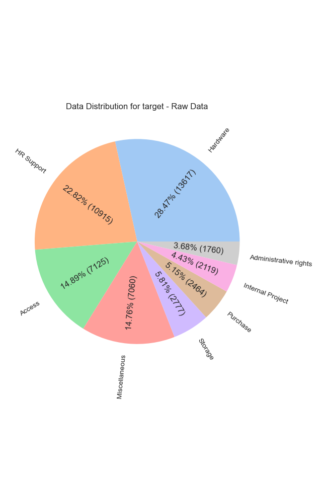
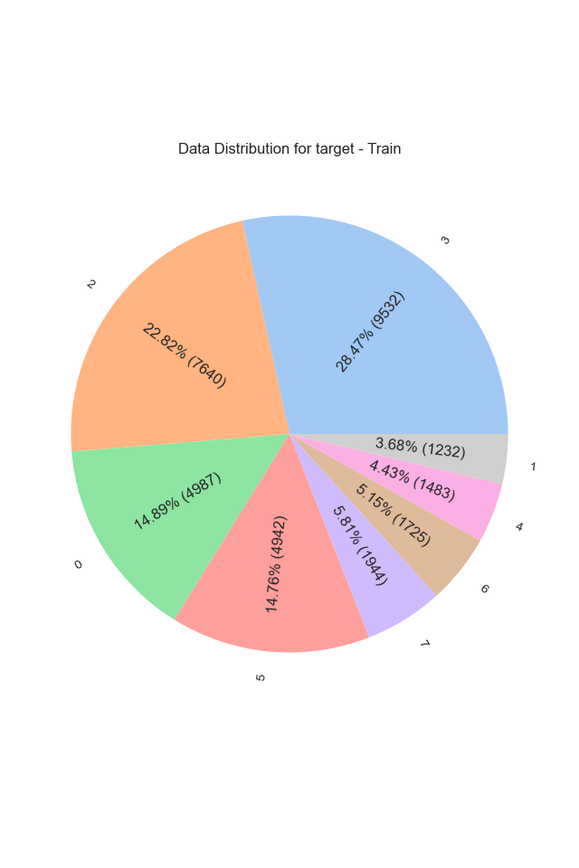
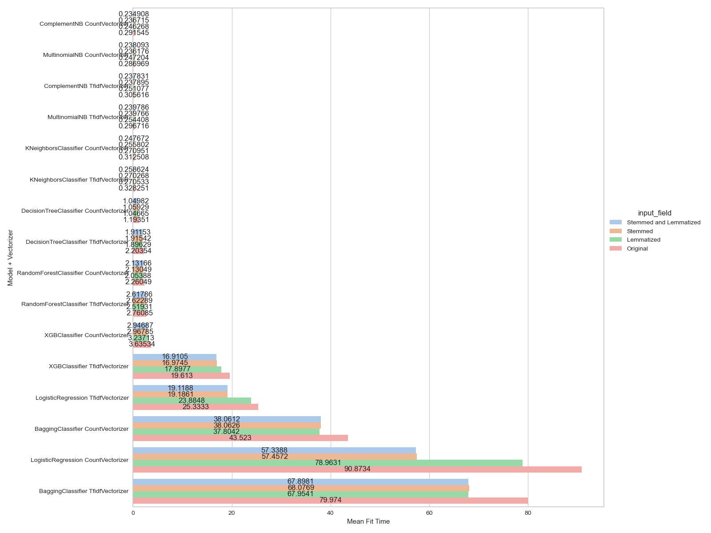

# Capstone: IT Service Ticket Classification
<b color="red">NOTE: All images are clickable and higher resolution images will load in new browser window</b>
## Background
Most companies have a service desk to help their user or customers with their IT problems.
Customers log and track their ticket in some digital platform and these get routed to Agents to solve.
Routing these tickets to the correct person/team to solve is very important:
- A common approach is to "tag" the ticket with some classification and there is a mapping that routes based on the tag to the correct team to solve it.
- Tickets incorrectly classified result in them "bouncing around" and wasting both agents and customer time.
- There is a financial impact resulting in wasted internal resources and lower customer satisfaction costing the company in real world dollars as well as reputation.
- The scale of the problem grows as you service more users as you need more and more agents to help.


This project aims to address this task by finding and building a model to aid in the classification of these tickets into appropriate categories. We will experiment with various types of pre-processing, vectorizers and regression models to help us find the best one to solve for this.

**Dataset**: [IT Service Ticket Classification Dataset](https://www.kaggle.com/datasets/adisongoh/it-service-ticket-classification-dataset)
- This dataset contains 47,837 rows of data and 2 features.

We will follow the CRISP-DM process model consisting of Business Understanding, Data Understanding, Data Preparation, Modeling, Evaluation, Deployment stages.


## Research Code
**Code:** [Data Analysis Workbook](./capstone.out.ipynb)

**NOTE:** *The processing of the juypter notebook take a long time and often disconnects from the session. In order to run it without monitoring it all the time use the wokraround below from command line.*
```
jupyter nbconvert --to notebook --execute {input_notebook} --output={output_notebook} --ExecutePreprocessor.timeout=-1
```
<sub>Source: [screen-and-jupyter-a-way-to-run-long-notebooks-headles](https://www.maksimeren.com/post/screen-and-jupyter-a-way-to-run-long-notebooks-headless/)</sub>


## Business Understanding
Our goal is to:
- Come up with the best classification model to correctly classify the tickets based solely on the description.
- Provide the business with the best model and hyperparameters to drive the best ROC AUC score.
  - We choose ROC AUC score because:
    - We are doing classification and it is particulary subject to the [Accuracy Paradox](https://en.wikipedia.org/wiki/Accuracy_paradox) because of class imbalance in this set.
    - It is generally preferred for imbalanced data. In addition we should make sure to use OVR during grid search for this (imbalance) reason.
- Provide the business with alternative models trading ROC AUC score for performance in case that may be a concern or to scale for a much larger dataset that may need re-training.


## Data Understanding
### Data Shape
### Raw

<table><tr><th>info()</th><tr><td><pre><class 'pandas.core.frame.DataFrame'>
RangeIndex: 47837 entries, 0 to 47836
Data columns (total 2 columns):
 #   Column    Non-Null Count  Dtype 
---  ------    --------------  ----- 
 0   Original  47837 non-null  object
 1   target    47837 non-null  object
dtypes: object(2)
memory usage: 747.6+ KB
</pre></td></tr></table>

### Data Sample
<table border="1" class="dataframe">
  <thead>
    <tr style="text-align: right;">
      <th>Original</th>
      <th>target</th>
    </tr>
  </thead>
  <tbody>
    <tr>
      <td>account locked re locked thank you for working best regards sent locked importance high dear can you please help colleague able log his computer after changing password thank you very much best regards</td>
      <td>Access</td>
    </tr>
    <tr>
      <td>confluence user confluence user hello name confluence thank</td>
      <td>Access</td>
    </tr>
    <tr>
      <td>windows upgrade upgrade dear after upgrading able connect via have attached logs app can you please help thanks senior software developer</td>
      <td>Administrative rights</td>
    </tr>
    <tr>
      <td>upgrade friday october pm upgrade hello followed instructions package install software center please advise thanks october upgrade hello everyone kind reminder please make update latest version assets highly critical perform upgrade by starting next upgrade pushed assets out date find detailed instructions how perform upgrade please note during update process lose approximately minutes questions encounter difficulties upgrading please hesitate thank kind regards ext october upgrade hello everyone please advised update version version assets highly critical perform upgrade during two weeks based availability order avoid virus attacks latest virus database available order update please follow steps more detailed guide found software center by searching software center search menu best endpoint agent install selected wait installation status becomes installed reboot computer icons newly installed endpoint tools note during update process lose approximately minutes questions encounter difficulties upgrading please hesitate thank kind regards ext hub</td>
      <td>Administrative rights</td>
    </tr>
    <tr>
      <td>oracle error when trying to log time on day th of error when trying log th hi guys getting error when trying log th you can create card only between start date end date dec can you please help out with thanks</td>
      <td>HR Support</td>
    </tr>
    <tr>
      <td>new pas close close dear ask please close opportunity active more date possible thank officer</td>
      <td>HR Support</td>
    </tr>
    <tr>
      <td>mail friday pm se la issue si la va similar cum se fond lead</td>
      <td>Hardware</td>
    </tr>
    <tr>
      <td>incident regarding installed programs and windows start incident hello please be advised today had incident with laptop none programs were installed anything start thank you applications engineer en</td>
      <td>Hardware</td>
    </tr>
    <tr>
      <td>project code delete thursday code delete hi please code thank</td>
      <td>Internal Project</td>
    </tr>
    <tr>
      <td>new project code pas tuesday pm setup has assigned hi please assign kind regards pm setup has assigned hello please advised record number has assigned please review details take appropriate action reference number details assign reference assignment summary null choose template applicable setup please provide short description setup details please attach completed setup form link forms policies forms policies procedures priority affected add requested location center location center please link kind regards ref msg</td>
      <td>Internal Project</td>
    </tr>
    <tr>
      <td>oracle project management change for thursday pm change hi given please thanks</td>
      <td>Miscellaneous</td>
    </tr>
    <tr>
      <td>stuck oracle stuck hi guys for some strange reason we cannot find process does show up processing queue although fully approved could you please kindly check what happened transaction advise hi could you please kindly log ticket thanks kind regards manager</td>
      <td>Miscellaneous</td>
    </tr>
    <tr>
      <td>thursday pm hey folks keyboard kb has please log installed please perform purchase order how presentation thanks administrator phone</td>
      <td>Purchase</td>
    </tr>
    <tr>
      <td>new purchase po wednesday march pm purchase po dear purchased keyboard please log installation please take consideration mandatory receipts section order receive item ordered how video kind regards administrator</td>
      <td>Purchase</td>
    </tr>
    <tr>
      <td>mailbox full sent saturday full hello full even if space does gets freed</td>
      <td>Storage</td>
    </tr>
    <tr>
      <td>mailbox com wednesday october pm mailbox hi please assist setting dedicated mailbox main managing employer initiatives besides mailbox thank help regards digital communications</td>
      <td>Storage</td>
    </tr>
  </tbody>
</table>

### Features
- There is only one feature Original which is free form text
- There are no missing values
- All data appears to be in english
- All data appears to be lowercased
- The data set is somewhat large and the classes are imbalanced.
- The classification field target has 8 distinct values
<a href="./analysis_results/capstone.raw.targetField.distribution.png" target="_blank"></a>


## Data Preparation
### Pre-Processing Decisions
- We will need to:
  - lowercase the data
  - remove stop words
  - stem, lemmatize or combination of both
  - certain models only expect integer target classes (e.g. XGBoost) so we will LabelEncode and create a new encoded column for this.
    - Access = 0
    - Administrative rights = 1
    - HR Support = 2
    - Hardware = 3
    - Internal Project = 4
    - Miscellaneous = 5
    - Purchase = 6
    - Storage = 7
- We will create three columns for variations of stem, lemmatize, stem+lemmatize and then run through models to evaluate which is best
  - I am opting to do this here because while normally we would bake this into the Pipeline since we are experimenting I want to optmize the process and just process these once instead of each time we switch the model during cross validation stage.<a href="./analysis_results/capstone.pre_process.token_count_distribution.png" target="_blank"></a>

### Analysis
- It is interesting to note both looking at the data and the distribution plot of tokens which doesn't appear to shift much after pre-processing that the data has been through some level of pre-processing already.
- Once pre-processing is done a majority of the tokens fall below 200 we can use this to set the upper bound for some of the model hyperparameters.


## Modeling
### Feature Engineering Decisions
- No real feature engineering is needed as we have no missing data and nothing to impute. The preprocessing takes care of most of the needs for stemming and lemmatization before our modeling stage.
- When creating intial train and test sets (30% of data for testing) we will stratify the set so that both train and test sets contain similar percentages of the classes because they are imbalanced.
- When we do our grid search split because the target classes are imbalanced we will use StratifiedKFold so the splits are representative of the orginal set and class balances.
- We will try the following models:
  - LogisticRegression: We will use elasticnet since it intergates l1 and l2 penalties rather than having to pick between ridge and lasso.
  - Decision Tree: While not expecting the best performance a decision tree could help us in explainability of how a decision is made and derive important "features/tokens"
  - Naive Bayes: We will use Multinomail and Complement. Complement is meant to deal better with imbalanced classes but we shall see.
  - KNN: Will use k nearest neigbhours, one would expect that tickets in the same category would have similar words and so would cluster well together
- In addition we will try some ensemble techniques:
  - XGBoost: We will use the XGBClassifier with a multi:softmax objective since we have a non binary classification case.
  - Random Forest: We will use the RandomForestClassifier which will combine multiple Decision tree created using random subsets of data.
  - Bagging: We will use the BaggingClassifier which will combine multiple "weak" classifiers (In this case DecisionTreeClassifier but we have control of using other models should we want to try).

### Data Distribution
Checking to make sure our test and train datasets represent the class imbalances
<table>
<tr>
<td>
<a href="./analysis_results/capstone.model_results.y_train.targetField.distribution.png" target="_blank"></a></td>
<td>
<a href="./analysis_results/capstone.model_results.y_test.targetField.distribution.png" target="_blank"></a></td>
</tr>
</table>

### Model Results

<table id="T_29042">
  <thead>
    <tr>
      <th id="T_29042_level0_col0" class="col_heading level0 col0" >model</th>
      <th id="T_29042_level0_col1" class="col_heading level0 col1" >vectorizer</th>
      <th id="T_29042_level0_col2" class="col_heading level0 col2" >input_field</th>
      <th id="T_29042_level0_col3" class="col_heading level0 col3" >best_score</th>
      <th id="T_29042_level0_col4" class="col_heading level0 col4" >mean_fit_time</th>
      <th id="T_29042_level0_col5" class="col_heading level0 col5" >best_params</th>
      <th id="T_29042_level0_col6" class="col_heading level0 col6" >run_time</th>
    </tr>
  </thead>
  <tbody>
    <tr>
      <td id="T_29042_row0_col0" class="data row0 col0" >DecisionTreeClassifier</td>
      <td id="T_29042_row0_col1" class="data row0 col1" >CountVectorizer</td>
      <td id="T_29042_row0_col2" class="data row0 col2" >Original</td>
      <td id="T_29042_row0_col3" class="data row0 col3" >0.880906</td>
      <td id="T_29042_row0_col4" class="data row0 col4" >1.193505</td>
      <td id="T_29042_row0_col5" class="data row0 col5" >{"model__criterion": "entropy", "model__max_depth": 25, "vectorizer__max_features": null}</td>
      <td id="T_29042_row0_col6" class="data row0 col6" >29.376820</td>
    </tr>
    <tr>
      <td id="T_29042_row1_col0" class="data row1 col0" >DecisionTreeClassifier</td>
      <td id="T_29042_row1_col1" class="data row1 col1" >CountVectorizer</td>
      <td id="T_29042_row1_col2" class="data row1 col2" >Stemmed</td>
      <td id="T_29042_row1_col3" class="data row1 col3" >0.883830</td>
      <td id="T_29042_row1_col4" class="data row1 col4" >1.059290</td>
      <td id="T_29042_row1_col5" class="data row1 col5" >{"model__criterion": "entropy", "model__max_depth": 25, "vectorizer__max_features": null}</td>
      <td id="T_29042_row1_col6" class="data row1 col6" >25.438417</td>
    </tr>
    <tr>
      <td id="T_29042_row2_col0" class="data row2 col0" >DecisionTreeClassifier</td>
      <td id="T_29042_row2_col1" class="data row2 col1" >CountVectorizer</td>
      <td id="T_29042_row2_col2" class="data row2 col2" >Lemmatized</td>
      <td id="T_29042_row2_col3" class="data row2 col3" >0.882731</td>
      <td id="T_29042_row2_col4" class="data row2 col4" >1.046649</td>
      <td id="T_29042_row2_col5" class="data row2 col5" >{"model__criterion": "entropy", "model__max_depth": 25, "vectorizer__max_features": null}</td>
      <td id="T_29042_row2_col6" class="data row2 col6" >25.314366</td>
    </tr>
    <tr>
      <td id="T_29042_row3_col0" class="data row3 col0" >DecisionTreeClassifier</td>
      <td id="T_29042_row3_col1" class="data row3 col1" >CountVectorizer</td>
      <td id="T_29042_row3_col2" class="data row3 col2" >Stemmed and Lemmatized</td>
      <td id="T_29042_row3_col3" class="data row3 col3" >0.885090</td>
      <td id="T_29042_row3_col4" class="data row3 col4" >1.049817</td>
      <td id="T_29042_row3_col5" class="data row3 col5" >{"model__criterion": "entropy", "model__max_depth": 25, "vectorizer__max_features": null}</td>
      <td id="T_29042_row3_col6" class="data row3 col6" >25.283688</td>
    </tr>
    <tr>
      <td id="T_29042_row4_col0" class="data row4 col0" >DecisionTreeClassifier</td>
      <td id="T_29042_row4_col1" class="data row4 col1" >TfidfVectorizer</td>
      <td id="T_29042_row4_col2" class="data row4 col2" >Original</td>
      <td id="T_29042_row4_col3" class="data row4 col3" >0.883312</td>
      <td id="T_29042_row4_col4" class="data row4 col4" >2.203545</td>
      <td id="T_29042_row4_col5" class="data row4 col5" >{"model__criterion": "gini", "model__max_depth": 50, "vectorizer__max_features": null}</td>
      <td id="T_29042_row4_col6" class="data row4 col6" >51.766405</td>
    </tr>
    <tr>
      <td id="T_29042_row5_col0" class="data row5 col0" >DecisionTreeClassifier</td>
      <td id="T_29042_row5_col1" class="data row5 col1" >TfidfVectorizer</td>
      <td id="T_29042_row5_col2" class="data row5 col2" >Stemmed</td>
      <td id="T_29042_row5_col3" class="data row5 col3" >0.877467</td>
      <td id="T_29042_row5_col4" class="data row5 col4" >1.915424</td>
      <td id="T_29042_row5_col5" class="data row5 col5" >{"model__criterion": "entropy", "model__max_depth": 25, "vectorizer__max_features": null}</td>
      <td id="T_29042_row5_col6" class="data row5 col6" >44.117501</td>
    </tr>
    <tr>
      <td id="T_29042_row6_col0" class="data row6 col0" >DecisionTreeClassifier</td>
      <td id="T_29042_row6_col1" class="data row6 col1" >TfidfVectorizer</td>
      <td id="T_29042_row6_col2" class="data row6 col2" >Lemmatized</td>
      <td id="T_29042_row6_col3" class="data row6 col3" >0.880878</td>
      <td id="T_29042_row6_col4" class="data row6 col4" >1.896291</td>
      <td id="T_29042_row6_col5" class="data row6 col5" >{"model__criterion": "entropy", "model__max_depth": 25, "vectorizer__max_features": null}</td>
      <td id="T_29042_row6_col6" class="data row6 col6" >43.583669</td>
    </tr>
    <tr>
      <td id="T_29042_row7_col0" class="data row7 col0" >DecisionTreeClassifier</td>
      <td id="T_29042_row7_col1" class="data row7 col1" >TfidfVectorizer</td>
      <td id="T_29042_row7_col2" class="data row7 col2" >Stemmed and Lemmatized</td>
      <td id="T_29042_row7_col3" class="data row7 col3" >0.881266</td>
      <td id="T_29042_row7_col4" class="data row7 col4" >1.911532</td>
      <td id="T_29042_row7_col5" class="data row7 col5" >{"model__criterion": "gini", "model__max_depth": 50, "vectorizer__max_features": null}</td>
      <td id="T_29042_row7_col6" class="data row7 col6" >44.550871</td>
    </tr>
    <tr>
      <td id="T_29042_row8_col0" class="data row8 col0" >KNeighborsClassifier</td>
      <td id="T_29042_row8_col1" class="data row8 col1" >CountVectorizer</td>
      <td id="T_29042_row8_col2" class="data row8 col2" >Original</td>
      <td id="T_29042_row8_col3" class="data row8 col3" >0.931534</td>
      <td id="T_29042_row8_col4" class="data row8 col4" >0.312508</td>
      <td id="T_29042_row8_col5" class="data row8 col5" >{"model__n_neighbors": 100, "model__weights": "distance", "vectorizer__max_features": null}</td>
      <td id="T_29042_row8_col6" class="data row8 col6" >107.176686</td>
    </tr>
    <tr>
      <td id="T_29042_row9_col0" class="data row9 col0" >KNeighborsClassifier</td>
      <td id="T_29042_row9_col1" class="data row9 col1" >CountVectorizer</td>
      <td id="T_29042_row9_col2" class="data row9 col2" >Stemmed</td>
      <td id="T_29042_row9_col3" class="data row9 col3" >0.942798</td>
      <td id="T_29042_row9_col4" class="data row9 col4" >0.255802</td>
      <td id="T_29042_row9_col5" class="data row9 col5" >{"model__n_neighbors": 100, "model__weights": "distance", "vectorizer__max_features": 500}</td>
      <td id="T_29042_row9_col6" class="data row9 col6" >165.264951</td>
    </tr>
    <tr>
      <td id="T_29042_row10_col0" class="data row10 col0" >KNeighborsClassifier</td>
      <td id="T_29042_row10_col1" class="data row10 col1" >CountVectorizer</td>
      <td id="T_29042_row10_col2" class="data row10 col2" >Lemmatized</td>
      <td id="T_29042_row10_col3" class="data row10 col3" >0.938484</td>
      <td id="T_29042_row10_col4" class="data row10 col4" >0.270951</td>
      <td id="T_29042_row10_col5" class="data row10 col5" >{"model__n_neighbors": 100, "model__weights": "distance", "vectorizer__max_features": 500}</td>
      <td id="T_29042_row10_col6" class="data row10 col6" >104.686211</td>
    </tr>
    <tr>
      <td id="T_29042_row11_col0" class="data row11 col0" >KNeighborsClassifier</td>
      <td id="T_29042_row11_col1" class="data row11 col1" >CountVectorizer</td>
      <td id="T_29042_row11_col2" class="data row11 col2" >Stemmed and Lemmatized</td>
      <td id="T_29042_row11_col3" class="data row11 col3" >0.942643</td>
      <td id="T_29042_row11_col4" class="data row11 col4" >0.247672</td>
      <td id="T_29042_row11_col5" class="data row11 col5" >{"model__n_neighbors": 100, "model__weights": "distance", "vectorizer__max_features": 500}</td>
      <td id="T_29042_row11_col6" class="data row11 col6" >165.267842</td>
    </tr>
    <tr>
      <td id="T_29042_row12_col0" class="data row12 col0" >KNeighborsClassifier</td>
      <td id="T_29042_row12_col1" class="data row12 col1" >TfidfVectorizer</td>
      <td id="T_29042_row12_col2" class="data row12 col2" >Original</td>
      <td id="T_29042_row12_col3" class="data row12 col3" >0.973472</td>
      <td id="T_29042_row12_col4" class="data row12 col4" >0.328251</td>
      <td id="T_29042_row12_col5" class="data row12 col5" >{"model__n_neighbors": 500, "model__weights": "distance", "vectorizer__max_features": null}</td>
      <td id="T_29042_row12_col6" class="data row12 col6" >121.556900</td>
    </tr>
    <tr>
      <td id="T_29042_row13_col0" class="data row13 col0" >KNeighborsClassifier</td>
      <td id="T_29042_row13_col1" class="data row13 col1" >TfidfVectorizer</td>
      <td id="T_29042_row13_col2" class="data row13 col2" >Stemmed</td>
      <td id="T_29042_row13_col3" class="data row13 col3" >0.971769</td>
      <td id="T_29042_row13_col4" class="data row13 col4" >0.270268</td>
      <td id="T_29042_row13_col5" class="data row13 col5" >{"model__n_neighbors": 500, "model__weights": "distance", "vectorizer__max_features": null}</td>
      <td id="T_29042_row13_col6" class="data row13 col6" >137.881482</td>
    </tr>
    <tr>
      <td id="T_29042_row14_col0" class="data row14 col0" >KNeighborsClassifier</td>
      <td id="T_29042_row14_col1" class="data row14 col1" >TfidfVectorizer</td>
      <td id="T_29042_row14_col2" class="data row14 col2" >Lemmatized</td>
      <td id="T_29042_row14_col3" class="data row14 col3" >0.972244</td>
      <td id="T_29042_row14_col4" class="data row14 col4" >0.270533</td>
      <td id="T_29042_row14_col5" class="data row14 col5" >{"model__n_neighbors": 500, "model__weights": "distance", "vectorizer__max_features": null}</td>
      <td id="T_29042_row14_col6" class="data row14 col6" >106.810837</td>
    </tr>
    <tr>
      <td id="T_29042_row15_col0" class="data row15 col0" >KNeighborsClassifier</td>
      <td id="T_29042_row15_col1" class="data row15 col1" >TfidfVectorizer</td>
      <td id="T_29042_row15_col2" class="data row15 col2" >Stemmed and Lemmatized</td>
      <td id="T_29042_row15_col3" class="data row15 col3" >0.971738</td>
      <td id="T_29042_row15_col4" class="data row15 col4" >0.258624</td>
      <td id="T_29042_row15_col5" class="data row15 col5" >{"model__n_neighbors": 500, "model__weights": "distance", "vectorizer__max_features": null}</td>
      <td id="T_29042_row15_col6" class="data row15 col6" >152.140115</td>
    </tr>
    <tr>
      <td id="T_29042_row16_col0" class="data row16 col0" >MultinomialNB</td>
      <td id="T_29042_row16_col1" class="data row16 col1" >CountVectorizer</td>
      <td id="T_29042_row16_col2" class="data row16 col2" >Original</td>
      <td id="T_29042_row16_col3" class="data row16 col3" >0.953175</td>
      <td id="T_29042_row16_col4" class="data row16 col4" >0.286969</td>
      <td id="T_29042_row16_col5" class="data row16 col5" >{"model__alpha": 1, "vectorizer__max_features": null}</td>
      <td id="T_29042_row16_col6" class="data row16 col6" >5.061755</td>
    </tr>
    <tr>
      <td id="T_29042_row17_col0" class="data row17 col0" >MultinomialNB</td>
      <td id="T_29042_row17_col1" class="data row17 col1" >CountVectorizer</td>
      <td id="T_29042_row17_col2" class="data row17 col2" >Stemmed</td>
      <td id="T_29042_row17_col3" class="data row17 col3" >0.954360</td>
      <td id="T_29042_row17_col4" class="data row17 col4" >0.236176</td>
      <td id="T_29042_row17_col5" class="data row17 col5" >{"model__alpha": 1, "vectorizer__max_features": null}</td>
      <td id="T_29042_row17_col6" class="data row17 col6" >4.384494</td>
    </tr>
    <tr>
      <td id="T_29042_row18_col0" class="data row18 col0" >MultinomialNB</td>
      <td id="T_29042_row18_col1" class="data row18 col1" >CountVectorizer</td>
      <td id="T_29042_row18_col2" class="data row18 col2" >Lemmatized</td>
      <td id="T_29042_row18_col3" class="data row18 col3" >0.955302</td>
      <td id="T_29042_row18_col4" class="data row18 col4" >0.247204</td>
      <td id="T_29042_row18_col5" class="data row18 col5" >{"model__alpha": 1, "vectorizer__max_features": null}</td>
      <td id="T_29042_row18_col6" class="data row18 col6" >4.439699</td>
    </tr>
    <tr>
      <td id="T_29042_row19_col0" class="data row19 col0" >MultinomialNB</td>
      <td id="T_29042_row19_col1" class="data row19 col1" >CountVectorizer</td>
      <td id="T_29042_row19_col2" class="data row19 col2" >Stemmed and Lemmatized</td>
      <td id="T_29042_row19_col3" class="data row19 col3" >0.954424</td>
      <td id="T_29042_row19_col4" class="data row19 col4" >0.238093</td>
      <td id="T_29042_row19_col5" class="data row19 col5" >{"model__alpha": 1, "vectorizer__max_features": null}</td>
      <td id="T_29042_row19_col6" class="data row19 col6" >4.474550</td>
    </tr>
    <tr>
      <td id="T_29042_row20_col0" class="data row20 col0" >MultinomialNB</td>
      <td id="T_29042_row20_col1" class="data row20 col1" >TfidfVectorizer</td>
      <td id="T_29042_row20_col2" class="data row20 col2" >Original</td>
      <td id="T_29042_row20_col3" class="data row20 col3" >0.964878</td>
      <td id="T_29042_row20_col4" class="data row20 col4" >0.296716</td>
      <td id="T_29042_row20_col5" class="data row20 col5" >{"model__alpha": 0.1, "vectorizer__max_features": null}</td>
      <td id="T_29042_row20_col6" class="data row20 col6" >5.114765</td>
    </tr>
    <tr>
      <td id="T_29042_row21_col0" class="data row21 col0" >MultinomialNB</td>
      <td id="T_29042_row21_col1" class="data row21 col1" >TfidfVectorizer</td>
      <td id="T_29042_row21_col2" class="data row21 col2" >Stemmed</td>
      <td id="T_29042_row21_col3" class="data row21 col3" >0.965847</td>
      <td id="T_29042_row21_col4" class="data row21 col4" >0.239766</td>
      <td id="T_29042_row21_col5" class="data row21 col5" >{"model__alpha": 1, "vectorizer__max_features": 500}</td>
      <td id="T_29042_row21_col6" class="data row21 col6" >4.524948</td>
    </tr>
    <tr>
      <td id="T_29042_row22_col0" class="data row22 col0" >MultinomialNB</td>
      <td id="T_29042_row22_col1" class="data row22 col1" >TfidfVectorizer</td>
      <td id="T_29042_row22_col2" class="data row22 col2" >Lemmatized</td>
      <td id="T_29042_row22_col3" class="data row22 col3" >0.965914</td>
      <td id="T_29042_row22_col4" class="data row22 col4" >0.254408</td>
      <td id="T_29042_row22_col5" class="data row22 col5" >{"model__alpha": 1, "vectorizer__max_features": 500}</td>
      <td id="T_29042_row22_col6" class="data row22 col6" >4.696984</td>
    </tr>
    <tr>
      <td id="T_29042_row23_col0" class="data row23 col0" >MultinomialNB</td>
      <td id="T_29042_row23_col1" class="data row23 col1" >TfidfVectorizer</td>
      <td id="T_29042_row23_col2" class="data row23 col2" >Stemmed and Lemmatized</td>
      <td id="T_29042_row23_col3" class="data row23 col3" >0.965847</td>
      <td id="T_29042_row23_col4" class="data row23 col4" >0.239786</td>
      <td id="T_29042_row23_col5" class="data row23 col5" >{"model__alpha": 1, "vectorizer__max_features": 500}</td>
      <td id="T_29042_row23_col6" class="data row23 col6" >4.393879</td>
    </tr>
    <tr>
      <td id="T_29042_row24_col0" class="data row24 col0" >ComplementNB</td>
      <td id="T_29042_row24_col1" class="data row24 col1" >CountVectorizer</td>
      <td id="T_29042_row24_col2" class="data row24 col2" >Original</td>
      <td id="T_29042_row24_col3" class="data row24 col3" >0.944329</td>
      <td id="T_29042_row24_col4" class="data row24 col4" >0.291545</td>
      <td id="T_29042_row24_col5" class="data row24 col5" >{"model__alpha": 1, "vectorizer__max_features": null}</td>
      <td id="T_29042_row24_col6" class="data row24 col6" >5.216317</td>
    </tr>
    <tr>
      <td id="T_29042_row25_col0" class="data row25 col0" >ComplementNB</td>
      <td id="T_29042_row25_col1" class="data row25 col1" >CountVectorizer</td>
      <td id="T_29042_row25_col2" class="data row25 col2" >Stemmed</td>
      <td id="T_29042_row25_col3" class="data row25 col3" >0.943821</td>
      <td id="T_29042_row25_col4" class="data row25 col4" >0.236715</td>
      <td id="T_29042_row25_col5" class="data row25 col5" >{"model__alpha": 1, "vectorizer__max_features": null}</td>
      <td id="T_29042_row25_col6" class="data row25 col6" >4.530648</td>
    </tr>
    <tr>
      <td id="T_29042_row26_col0" class="data row26 col0" >ComplementNB</td>
      <td id="T_29042_row26_col1" class="data row26 col1" >CountVectorizer</td>
      <td id="T_29042_row26_col2" class="data row26 col2" >Lemmatized</td>
      <td id="T_29042_row26_col3" class="data row26 col3" >0.945060</td>
      <td id="T_29042_row26_col4" class="data row26 col4" >0.246268</td>
      <td id="T_29042_row26_col5" class="data row26 col5" >{"model__alpha": 1, "vectorizer__max_features": null}</td>
      <td id="T_29042_row26_col6" class="data row26 col6" >4.464471</td>
    </tr>
    <tr>
      <td id="T_29042_row27_col0" class="data row27 col0" >ComplementNB</td>
      <td id="T_29042_row27_col1" class="data row27 col1" >CountVectorizer</td>
      <td id="T_29042_row27_col2" class="data row27 col2" >Stemmed and Lemmatized</td>
      <td id="T_29042_row27_col3" class="data row27 col3" >0.943771</td>
      <td id="T_29042_row27_col4" class="data row27 col4" >0.234908</td>
      <td id="T_29042_row27_col5" class="data row27 col5" >{"model__alpha": 1, "vectorizer__max_features": null}</td>
      <td id="T_29042_row27_col6" class="data row27 col6" >4.372359</td>
    </tr>
    <tr>
      <td id="T_29042_row28_col0" class="data row28 col0" >ComplementNB</td>
      <td id="T_29042_row28_col1" class="data row28 col1" >TfidfVectorizer</td>
      <td id="T_29042_row28_col2" class="data row28 col2" >Original</td>
      <td id="T_29042_row28_col3" class="data row28 col3" >0.971004</td>
      <td id="T_29042_row28_col4" class="data row28 col4" >0.305616</td>
      <td id="T_29042_row28_col5" class="data row28 col5" >{"model__alpha": 1, "vectorizer__max_features": null}</td>
      <td id="T_29042_row28_col6" class="data row28 col6" >5.484758</td>
    </tr>
    <tr>
      <td id="T_29042_row29_col0" class="data row29 col0" >ComplementNB</td>
      <td id="T_29042_row29_col1" class="data row29 col1" >TfidfVectorizer</td>
      <td id="T_29042_row29_col2" class="data row29 col2" >Stemmed</td>
      <td id="T_29042_row29_col3" class="data row29 col3" >0.969519</td>
      <td id="T_29042_row29_col4" class="data row29 col4" >0.237895</td>
      <td id="T_29042_row29_col5" class="data row29 col5" >{"model__alpha": 1, "vectorizer__max_features": null}</td>
      <td id="T_29042_row29_col6" class="data row29 col6" >4.435607</td>
    </tr>
    <tr>
      <td id="T_29042_row30_col0" class="data row30 col0" >ComplementNB</td>
      <td id="T_29042_row30_col1" class="data row30 col1" >TfidfVectorizer</td>
      <td id="T_29042_row30_col2" class="data row30 col2" >Lemmatized</td>
      <td id="T_29042_row30_col3" class="data row30 col3" >0.969854</td>
      <td id="T_29042_row30_col4" class="data row30 col4" >0.251077</td>
      <td id="T_29042_row30_col5" class="data row30 col5" >{"model__alpha": 1, "vectorizer__max_features": null}</td>
      <td id="T_29042_row30_col6" class="data row30 col6" >4.600548</td>
    </tr>
    <tr>
      <td id="T_29042_row31_col0" class="data row31 col0" >ComplementNB</td>
      <td id="T_29042_row31_col1" class="data row31 col1" >TfidfVectorizer</td>
      <td id="T_29042_row31_col2" class="data row31 col2" >Stemmed and Lemmatized</td>
      <td id="T_29042_row31_col3" class="data row31 col3" >0.969578</td>
      <td id="T_29042_row31_col4" class="data row31 col4" >0.237831</td>
      <td id="T_29042_row31_col5" class="data row31 col5" >{"model__alpha": 1, "vectorizer__max_features": null}</td>
      <td id="T_29042_row31_col6" class="data row31 col6" >4.595905</td>
    </tr>
    <tr>
      <td id="T_29042_row32_col0" class="data row32 col0" >LogisticRegression</td>
      <td id="T_29042_row32_col1" class="data row32 col1" >CountVectorizer</td>
      <td id="T_29042_row32_col2" class="data row32 col2" >Original</td>
      <td id="T_29042_row32_col3" class="data row32 col3" >0.958691</td>
      <td id="T_29042_row32_col4" class="data row32 col4" >90.873420</td>
      <td id="T_29042_row32_col5" class="data row32 col5" >{"model__C": 100, "model__l1_ratio": 0.0, "model__penalty": "elasticnet", "model__solver": "saga", "vectorizer__max_features": null}</td>
      <td id="T_29042_row32_col6" class="data row32 col6" >5008.611961</td>
    </tr>
    <tr>
      <td id="T_29042_row33_col0" class="data row33 col0" >LogisticRegression</td>
      <td id="T_29042_row33_col1" class="data row33 col1" >CountVectorizer</td>
      <td id="T_29042_row33_col2" class="data row33 col2" >Stemmed</td>
      <td id="T_29042_row33_col3" class="data row33 col3" >0.960372</td>
      <td id="T_29042_row33_col4" class="data row33 col4" >57.457154</td>
      <td id="T_29042_row33_col5" class="data row33 col5" >{"model__C": 100, "model__l1_ratio": 0.25, "model__penalty": "elasticnet", "model__solver": "saga", "vectorizer__max_features": null}</td>
      <td id="T_29042_row33_col6" class="data row33 col6" >3743.248646</td>
    </tr>
    <tr>
      <td id="T_29042_row34_col0" class="data row34 col0" >LogisticRegression</td>
      <td id="T_29042_row34_col1" class="data row34 col1" >CountVectorizer</td>
      <td id="T_29042_row34_col2" class="data row34 col2" >Lemmatized</td>
      <td id="T_29042_row34_col3" class="data row34 col3" >0.960110</td>
      <td id="T_29042_row34_col4" class="data row34 col4" >78.963146</td>
      <td id="T_29042_row34_col5" class="data row34 col5" >{"model__C": 100, "model__l1_ratio": 0.5, "model__penalty": "elasticnet", "model__solver": "saga", "vectorizer__max_features": null}</td>
      <td id="T_29042_row34_col6" class="data row34 col6" >5280.003322</td>
    </tr>
    <tr>
      <td id="T_29042_row35_col0" class="data row35 col0" >LogisticRegression</td>
      <td id="T_29042_row35_col1" class="data row35 col1" >CountVectorizer</td>
      <td id="T_29042_row35_col2" class="data row35 col2" >Stemmed and Lemmatized</td>
      <td id="T_29042_row35_col3" class="data row35 col3" >0.960340</td>
      <td id="T_29042_row35_col4" class="data row35 col4" >57.338801</td>
      <td id="T_29042_row35_col5" class="data row35 col5" >{"model__C": 100, "model__l1_ratio": 0.0, "model__penalty": "elasticnet", "model__solver": "saga", "vectorizer__max_features": null}</td>
      <td id="T_29042_row35_col6" class="data row35 col6" >3101.679289</td>
    </tr>
    <tr>
      <td id="T_29042_row36_col0" class="data row36 col0" >LogisticRegression</td>
      <td id="T_29042_row36_col1" class="data row36 col1" >TfidfVectorizer</td>
      <td id="T_29042_row36_col2" class="data row36 col2" >Original</td>
      <td id="T_29042_row36_col3" class="data row36 col3" >0.986617</td>
      <td id="T_29042_row36_col4" class="data row36 col4" >25.333251</td>
      <td id="T_29042_row36_col5" class="data row36 col5" >{"model__C": 1, "model__l1_ratio": 0.5, "model__penalty": "elasticnet", "model__solver": "saga", "vectorizer__max_features": null}</td>
      <td id="T_29042_row36_col6" class="data row36 col6" >1380.814533</td>
    </tr>
    <tr>
      <td id="T_29042_row37_col0" class="data row37 col0" >LogisticRegression</td>
      <td id="T_29042_row37_col1" class="data row37 col1" >TfidfVectorizer</td>
      <td id="T_29042_row37_col2" class="data row37 col2" >Stemmed</td>
      <td id="T_29042_row37_col3" class="data row37 col3" >0.984014</td>
      <td id="T_29042_row37_col4" class="data row37 col4" >19.186127</td>
      <td id="T_29042_row37_col5" class="data row37 col5" >{"model__C": 1, "model__l1_ratio": 0.25, "model__penalty": "elasticnet", "model__solver": "saga", "vectorizer__max_features": null}</td>
      <td id="T_29042_row37_col6" class="data row37 col6" >1046.609349</td>
    </tr>
    <tr>
      <td id="T_29042_row38_col0" class="data row38 col0" >LogisticRegression</td>
      <td id="T_29042_row38_col1" class="data row38 col1" >TfidfVectorizer</td>
      <td id="T_29042_row38_col2" class="data row38 col2" >Lemmatized</td>
      <td id="T_29042_row38_col3" class="data row38 col3" >0.984918</td>
      <td id="T_29042_row38_col4" class="data row38 col4" >23.884809</td>
      <td id="T_29042_row38_col5" class="data row38 col5" >{"model__C": 1, "model__l1_ratio": 0.25, "model__penalty": "elasticnet", "model__solver": "saga", "vectorizer__max_features": null}</td>
      <td id="T_29042_row38_col6" class="data row38 col6" >1384.790200</td>
    </tr>
    <tr>
      <td id="T_29042_row39_col0" class="data row39 col0" >LogisticRegression</td>
      <td id="T_29042_row39_col1" class="data row39 col1" >TfidfVectorizer</td>
      <td id="T_29042_row39_col2" class="data row39 col2" >Stemmed and Lemmatized</td>
      <td id="T_29042_row39_col3" class="data row39 col3" >0.984005</td>
      <td id="T_29042_row39_col4" class="data row39 col4" >19.118844</td>
      <td id="T_29042_row39_col5" class="data row39 col5" >{"model__C": 1, "model__l1_ratio": 0.25, "model__penalty": "elasticnet", "model__solver": "saga", "vectorizer__max_features": null}</td>
      <td id="T_29042_row39_col6" class="data row39 col6" >1048.918884</td>
    </tr>
    <tr>
      <td id="T_29042_row40_col0" class="data row40 col0" >XGBClassifier</td>
      <td id="T_29042_row40_col1" class="data row40 col1" >CountVectorizer</td>
      <td id="T_29042_row40_col2" class="data row40 col2" >Original</td>
      <td id="T_29042_row40_col3" class="data row40 col3" >0.985959</td>
      <td id="T_29042_row40_col4" class="data row40 col4" >3.635338</td>
      <td id="T_29042_row40_col5" class="data row40 col5" >{"model__colsample_bytree": 0.5, "model__max_depth": 10, "model__subsample": 0.7, "vectorizer__max_features": null}</td>
      <td id="T_29042_row40_col6" class="data row40 col6" >249.117185</td>
    </tr>
    <tr>
      <td id="T_29042_row41_col0" class="data row41 col0" >XGBClassifier</td>
      <td id="T_29042_row41_col1" class="data row41 col1" >CountVectorizer</td>
      <td id="T_29042_row41_col2" class="data row41 col2" >Stemmed</td>
      <td id="T_29042_row41_col3" class="data row41 col3" >0.985284</td>
      <td id="T_29042_row41_col4" class="data row41 col4" >2.967854</td>
      <td id="T_29042_row41_col5" class="data row41 col5" >{"model__colsample_bytree": 0.5, "model__max_depth": 10, "model__subsample": 0.7, "vectorizer__max_features": null}</td>
      <td id="T_29042_row41_col6" class="data row41 col6" >204.539993</td>
    </tr>
    <tr>
      <td id="T_29042_row42_col0" class="data row42 col0" >XGBClassifier</td>
      <td id="T_29042_row42_col1" class="data row42 col1" >CountVectorizer</td>
      <td id="T_29042_row42_col2" class="data row42 col2" >Lemmatized</td>
      <td id="T_29042_row42_col3" class="data row42 col3" >0.985588</td>
      <td id="T_29042_row42_col4" class="data row42 col4" >3.237125</td>
      <td id="T_29042_row42_col5" class="data row42 col5" >{"model__colsample_bytree": 0.7, "model__max_depth": 10, "model__subsample": 0.7, "vectorizer__max_features": null}</td>
      <td id="T_29042_row42_col6" class="data row42 col6" >222.565550</td>
    </tr>
    <tr>
      <td id="T_29042_row43_col0" class="data row43 col0" >XGBClassifier</td>
      <td id="T_29042_row43_col1" class="data row43 col1" >CountVectorizer</td>
      <td id="T_29042_row43_col2" class="data row43 col2" >Stemmed and Lemmatized</td>
      <td id="T_29042_row43_col3" class="data row43 col3" >0.985297</td>
      <td id="T_29042_row43_col4" class="data row43 col4" >2.946874</td>
      <td id="T_29042_row43_col5" class="data row43 col5" >{"model__colsample_bytree": 0.5, "model__max_depth": 10, "model__subsample": 0.7, "vectorizer__max_features": null}</td>
      <td id="T_29042_row43_col6" class="data row43 col6" >203.569864</td>
    </tr>
    <tr>
      <td id="T_29042_row44_col0" class="data row44 col0" >XGBClassifier</td>
      <td id="T_29042_row44_col1" class="data row44 col1" >TfidfVectorizer</td>
      <td id="T_29042_row44_col2" class="data row44 col2" >Original</td>
      <td id="T_29042_row44_col3" class="data row44 col3" >0.986995</td>
      <td id="T_29042_row44_col4" class="data row44 col4" >19.613042</td>
      <td id="T_29042_row44_col5" class="data row44 col5" >{"model__colsample_bytree": 0.5, "model__max_depth": 10, "model__subsample": 0.7, "vectorizer__max_features": null}</td>
      <td id="T_29042_row44_col6" class="data row44 col6" >1247.920159</td>
    </tr>
    <tr>
      <td id="T_29042_row45_col0" class="data row45 col0" >XGBClassifier</td>
      <td id="T_29042_row45_col1" class="data row45 col1" >TfidfVectorizer</td>
      <td id="T_29042_row45_col2" class="data row45 col2" >Stemmed</td>
      <td id="T_29042_row45_col3" class="data row45 col3" >0.985848</td>
      <td id="T_29042_row45_col4" class="data row45 col4" >16.974539</td>
      <td id="T_29042_row45_col5" class="data row45 col5" >{"model__colsample_bytree": 0.5, "model__max_depth": 10, "model__subsample": 0.7, "vectorizer__max_features": null}</td>
      <td id="T_29042_row45_col6" class="data row45 col6" >1083.131984</td>
    </tr>
    <tr>
      <td id="T_29042_row46_col0" class="data row46 col0" >XGBClassifier</td>
      <td id="T_29042_row46_col1" class="data row46 col1" >TfidfVectorizer</td>
      <td id="T_29042_row46_col2" class="data row46 col2" >Lemmatized</td>
      <td id="T_29042_row46_col3" class="data row46 col3" >0.986182</td>
      <td id="T_29042_row46_col4" class="data row46 col4" >17.897716</td>
      <td id="T_29042_row46_col5" class="data row46 col5" >{"model__colsample_bytree": 0.5, "model__max_depth": 10, "model__subsample": 0.7, "vectorizer__max_features": null}</td>
      <td id="T_29042_row46_col6" class="data row46 col6" >1136.221328</td>
    </tr>
    <tr>
      <td id="T_29042_row47_col0" class="data row47 col0" >XGBClassifier</td>
      <td id="T_29042_row47_col1" class="data row47 col1" >TfidfVectorizer</td>
      <td id="T_29042_row47_col2" class="data row47 col2" >Stemmed and Lemmatized</td>
      <td id="T_29042_row47_col3" class="data row47 col3" >0.985967</td>
      <td id="T_29042_row47_col4" class="data row47 col4" >16.910542</td>
      <td id="T_29042_row47_col5" class="data row47 col5" >{"model__colsample_bytree": 0.5, "model__max_depth": 10, "model__subsample": 1, "vectorizer__max_features": null}</td>
      <td id="T_29042_row47_col6" class="data row47 col6" >1079.451344</td>
    </tr>
    <tr>
      <td id="T_29042_row48_col0" class="data row48 col0" >BaggingClassifier</td>
      <td id="T_29042_row48_col1" class="data row48 col1" >CountVectorizer</td>
      <td id="T_29042_row48_col2" class="data row48 col2" >Original</td>
      <td id="T_29042_row48_col3" class="data row48 col3" >0.966127</td>
      <td id="T_29042_row48_col4" class="data row48 col4" >43.522997</td>
      <td id="T_29042_row48_col5" class="data row48 col5" >{"model__n_estimators": 100, "vectorizer__max_features": null}</td>
      <td id="T_29042_row48_col6" class="data row48 col6" >523.237538</td>
    </tr>
    <tr>
      <td id="T_29042_row49_col0" class="data row49 col0" >BaggingClassifier</td>
      <td id="T_29042_row49_col1" class="data row49 col1" >CountVectorizer</td>
      <td id="T_29042_row49_col2" class="data row49 col2" >Stemmed</td>
      <td id="T_29042_row49_col3" class="data row49 col3" >0.965380</td>
      <td id="T_29042_row49_col4" class="data row49 col4" >38.062631</td>
      <td id="T_29042_row49_col5" class="data row49 col5" >{"model__n_estimators": 100, "vectorizer__max_features": null}</td>
      <td id="T_29042_row49_col6" class="data row49 col6" >442.674253</td>
    </tr>
    <tr>
      <td id="T_29042_row50_col0" class="data row50 col0" >BaggingClassifier</td>
      <td id="T_29042_row50_col1" class="data row50 col1" >CountVectorizer</td>
      <td id="T_29042_row50_col2" class="data row50 col2" >Lemmatized</td>
      <td id="T_29042_row50_col3" class="data row50 col3" >0.964045</td>
      <td id="T_29042_row50_col4" class="data row50 col4" >37.804205</td>
      <td id="T_29042_row50_col5" class="data row50 col5" >{"model__n_estimators": 100, "vectorizer__max_features": null}</td>
      <td id="T_29042_row50_col6" class="data row50 col6" >449.177688</td>
    </tr>
    <tr>
      <td id="T_29042_row51_col0" class="data row51 col0" >BaggingClassifier</td>
      <td id="T_29042_row51_col1" class="data row51 col1" >CountVectorizer</td>
      <td id="T_29042_row51_col2" class="data row51 col2" >Stemmed and Lemmatized</td>
      <td id="T_29042_row51_col3" class="data row51 col3" >0.966269</td>
      <td id="T_29042_row51_col4" class="data row51 col4" >38.061219</td>
      <td id="T_29042_row51_col5" class="data row51 col5" >{"model__n_estimators": 100, "vectorizer__max_features": null}</td>
      <td id="T_29042_row51_col6" class="data row51 col6" >441.230571</td>
    </tr>
    <tr>
      <td id="T_29042_row52_col0" class="data row52 col0" >BaggingClassifier</td>
      <td id="T_29042_row52_col1" class="data row52 col1" >TfidfVectorizer</td>
      <td id="T_29042_row52_col2" class="data row52 col2" >Original</td>
      <td id="T_29042_row52_col3" class="data row52 col3" >0.970145</td>
      <td id="T_29042_row52_col4" class="data row52 col4" >79.973978</td>
      <td id="T_29042_row52_col5" class="data row52 col5" >{"model__n_estimators": 100, "vectorizer__max_features": null}</td>
      <td id="T_29042_row52_col6" class="data row52 col6" >953.591994</td>
    </tr>
    <tr>
      <td id="T_29042_row53_col0" class="data row53 col0" >BaggingClassifier</td>
      <td id="T_29042_row53_col1" class="data row53 col1" >TfidfVectorizer</td>
      <td id="T_29042_row53_col2" class="data row53 col2" >Stemmed</td>
      <td id="T_29042_row53_col3" class="data row53 col3" >0.970279</td>
      <td id="T_29042_row53_col4" class="data row53 col4" >68.076920</td>
      <td id="T_29042_row53_col5" class="data row53 col5" >{"model__n_estimators": 100, "vectorizer__max_features": null}</td>
      <td id="T_29042_row53_col6" class="data row53 col6" >785.487087</td>
    </tr>
    <tr>
      <td id="T_29042_row54_col0" class="data row54 col0" >BaggingClassifier</td>
      <td id="T_29042_row54_col1" class="data row54 col1" >TfidfVectorizer</td>
      <td id="T_29042_row54_col2" class="data row54 col2" >Lemmatized</td>
      <td id="T_29042_row54_col3" class="data row54 col3" >0.970210</td>
      <td id="T_29042_row54_col4" class="data row54 col4" >67.954085</td>
      <td id="T_29042_row54_col5" class="data row54 col5" >{"model__n_estimators": 100, "vectorizer__max_features": null}</td>
      <td id="T_29042_row54_col6" class="data row54 col6" >804.888307</td>
    </tr>
    <tr>
      <td id="T_29042_row55_col0" class="data row55 col0" >BaggingClassifier</td>
      <td id="T_29042_row55_col1" class="data row55 col1" >TfidfVectorizer</td>
      <td id="T_29042_row55_col2" class="data row55 col2" >Stemmed and Lemmatized</td>
      <td id="T_29042_row55_col3" class="data row55 col3" >0.970610</td>
      <td id="T_29042_row55_col4" class="data row55 col4" >67.898102</td>
      <td id="T_29042_row55_col5" class="data row55 col5" >{"model__n_estimators": 100, "vectorizer__max_features": null}</td>
      <td id="T_29042_row55_col6" class="data row55 col6" >782.555564</td>
    </tr>
    <tr>
      <td id="T_29042_row56_col0" class="data row56 col0" >RandomForestClassifier</td>
      <td id="T_29042_row56_col1" class="data row56 col1" >CountVectorizer</td>
      <td id="T_29042_row56_col2" class="data row56 col2" >Original</td>
      <td id="T_29042_row56_col3" class="data row56 col3" >0.975731</td>
      <td id="T_29042_row56_col4" class="data row56 col4" >2.260491</td>
      <td id="T_29042_row56_col5" class="data row56 col5" >{"model__class_weight": "balanced_subsample", "model__max_depth": 100, "model__n_estimators": 100, "vectorizer__max_features": null}</td>
      <td id="T_29042_row56_col6" class="data row56 col6" >215.116901</td>
    </tr>
    <tr>
      <td id="T_29042_row57_col0" class="data row57 col0" >RandomForestClassifier</td>
      <td id="T_29042_row57_col1" class="data row57 col1" >CountVectorizer</td>
      <td id="T_29042_row57_col2" class="data row57 col2" >Stemmed</td>
      <td id="T_29042_row57_col3" class="data row57 col3" >0.976997</td>
      <td id="T_29042_row57_col4" class="data row57 col4" >2.130489</td>
      <td id="T_29042_row57_col5" class="data row57 col5" >{"model__class_weight": "balanced", "model__max_depth": 100, "model__n_estimators": 100, "vectorizer__max_features": null}</td>
      <td id="T_29042_row57_col6" class="data row57 col6" >202.034706</td>
    </tr>
    <tr>
      <td id="T_29042_row58_col0" class="data row58 col0" >RandomForestClassifier</td>
      <td id="T_29042_row58_col1" class="data row58 col1" >CountVectorizer</td>
      <td id="T_29042_row58_col2" class="data row58 col2" >Lemmatized</td>
      <td id="T_29042_row58_col3" class="data row58 col3" >0.977167</td>
      <td id="T_29042_row58_col4" class="data row58 col4" >2.053881</td>
      <td id="T_29042_row58_col5" class="data row58 col5" >{"model__class_weight": "balanced", "model__max_depth": 100, "model__n_estimators": 100, "vectorizer__max_features": null}</td>
      <td id="T_29042_row58_col6" class="data row58 col6" >195.739830</td>
    </tr>
    <tr>
      <td id="T_29042_row59_col0" class="data row59 col0" >RandomForestClassifier</td>
      <td id="T_29042_row59_col1" class="data row59 col1" >CountVectorizer</td>
      <td id="T_29042_row59_col2" class="data row59 col2" >Stemmed and Lemmatized</td>
      <td id="T_29042_row59_col3" class="data row59 col3" >0.977309</td>
      <td id="T_29042_row59_col4" class="data row59 col4" >2.131661</td>
      <td id="T_29042_row59_col5" class="data row59 col5" >{"model__class_weight": "balanced_subsample", "model__max_depth": 100, "model__n_estimators": 100, "vectorizer__max_features": null}</td>
      <td id="T_29042_row59_col6" class="data row59 col6" >202.741420</td>
    </tr>
    <tr>
      <td id="T_29042_row60_col0" class="data row60 col0" >RandomForestClassifier</td>
      <td id="T_29042_row60_col1" class="data row60 col1" >TfidfVectorizer</td>
      <td id="T_29042_row60_col2" class="data row60 col2" >Original</td>
      <td id="T_29042_row60_col3" class="data row60 col3" >0.977435</td>
      <td id="T_29042_row60_col4" class="data row60 col4" >2.760853</td>
      <td id="T_29042_row60_col5" class="data row60 col5" >{"model__class_weight": "balanced_subsample", "model__max_depth": 100, "model__n_estimators": 100, "vectorizer__max_features": null}</td>
      <td id="T_29042_row60_col6" class="data row60 col6" >255.591368</td>
    </tr>
    <tr>
      <td id="T_29042_row61_col0" class="data row61 col0" >RandomForestClassifier</td>
      <td id="T_29042_row61_col1" class="data row61 col1" >TfidfVectorizer</td>
      <td id="T_29042_row61_col2" class="data row61 col2" >Stemmed</td>
      <td id="T_29042_row61_col3" class="data row61 col3" >0.978388</td>
      <td id="T_29042_row61_col4" class="data row61 col4" >2.622887</td>
      <td id="T_29042_row61_col5" class="data row61 col5" >{"model__class_weight": "balanced", "model__max_depth": 100, "model__n_estimators": 100, "vectorizer__max_features": null}</td>
      <td id="T_29042_row61_col6" class="data row61 col6" >241.573630</td>
    </tr>
    <tr>
      <td id="T_29042_row62_col0" class="data row62 col0" >RandomForestClassifier</td>
      <td id="T_29042_row62_col1" class="data row62 col1" >TfidfVectorizer</td>
      <td id="T_29042_row62_col2" class="data row62 col2" >Lemmatized</td>
      <td id="T_29042_row62_col3" class="data row62 col3" >0.978780</td>
      <td id="T_29042_row62_col4" class="data row62 col4" >2.519313</td>
      <td id="T_29042_row62_col5" class="data row62 col5" >{"model__class_weight": "balanced_subsample", "model__max_depth": 100, "model__n_estimators": 100, "vectorizer__max_features": null}</td>
      <td id="T_29042_row62_col6" class="data row62 col6" >233.885730</td>
    </tr>
    <tr>
      <td id="T_29042_row63_col0" class="data row63 col0" >RandomForestClassifier</td>
      <td id="T_29042_row63_col1" class="data row63 col1" >TfidfVectorizer</td>
      <td id="T_29042_row63_col2" class="data row63 col2" >Stemmed and Lemmatized</td>
      <td id="T_29042_row63_col3" class="data row63 col3" >0.979124</td>
      <td id="T_29042_row63_col4" class="data row63 col4" >2.617862</td>
      <td id="T_29042_row63_col5" class="data row63 col5" >{"model__class_weight": "balanced_subsample", "model__max_depth": 100, "model__n_estimators": 100, "vectorizer__max_features": null}</td>
      <td id="T_29042_row63_col6" class="data row63 col6" >241.511404</td>
    </tr>
  </tbody>
</table>


### Analysis
<table>
<tr>
<th>ROC AUC score</th>
<th>Fit Time</th>
</tr>
<tr>
<td><a href="./analysis_results/capstone.model_results.roc_auc_ovr.png" target="_blank"></a></td>
<td><a href="./analysis_results/capstone.model_results.fit_time.png" target="_blank"></a></td>
</tr>
<tr>
<td><ul>
<li>The best model was:
 XGBClassifier with vectorizer TfidfVectorizer with input pre-processing Original had ROC AUC score 98.69954725563986% and mean fit time of 19.61304181714853 seconds.</li><li>The worst model was:
 DecisionTreeClassifier with vectorizer TfidfVectorizer with input pre-processing Stemmed had ROC AUC score 87.74671564412645% and mean fit time of 1.915424230694771 seconds.</li></ul></td>
<td><ul>
<li>The fastest model was:
 ComplementNB with vectorizer CountVectorizer with input pre-processing Stemmed and Lemmatized had ROC AUC score 94.3771473528919% and mean fit time of 0.2349078516165416 seconds.</li><li>The slowest model was
 LogisticRegression with vectorizer CountVectorizer with input pre-processing Original had ROC AUC score 95.86914032273492% and mean fit time of 90.87342044671377 seconds.</li></ul></td>
</tr>
</table>


## Evaluation
We will now re-run our best pipeline discovered druing modeling which had an ROC AUC score of 98.70%:
- Preprocessing=Original
- Vectorizer=TfidfVectorizer
- Model=XGBClassifier ({"model__colsample_bytree": 0.5, "model__max_depth": 10, "model__subsample": 0.7, "vectorizer__max_features": null})

### Results
<table>
<tr>
<th></th>
<th>Train</th>
<th>Test</th>
</tr>
<tr>
<td>Classification Report</td>
<td>

```

              precision    recall  f1-score   support

           0       0.99      0.99      0.99      4987
           1       1.00      0.99      1.00      1232
           2       0.99      0.97      0.98      7640
           3       0.97      0.99      0.98      9532
           4       1.00      1.00      1.00      1483
           5       0.99      0.98      0.98      4942
           6       1.00      1.00      1.00      1725
           7       1.00      0.99      1.00      1944

    accuracy                           0.98     33485
   macro avg       0.99      0.99      0.99     33485
weighted avg       0.98      0.98      0.98     33485

```

</td>
<td>

```

              precision    recall  f1-score   support

           0       0.91      0.89      0.90      2138
           1       0.85      0.74      0.79       528
           2       0.89      0.87      0.88      3275
           3       0.80      0.89      0.84      4085
           4       0.91      0.82      0.86       636
           5       0.84      0.81      0.82      2118
           6       0.96      0.88      0.92       739
           7       0.93      0.86      0.89       833

    accuracy                           0.86     14352
   macro avg       0.89      0.84      0.86     14352
weighted avg       0.86      0.86      0.86     14352

```

</td>
</tr>
<tr>
<td>Confusion Matrix</td>
<td>

<a href="./analysis_results/capstone.evaluation.XGBClassifier.TfidfVectorizer.Original.confusion_matrix.train.png" target="_blank"></a></td>
<td>

<a href="./analysis_results/capstone.evaluation.XGBClassifier.TfidfVectorizer.Original.confusion_matrix.test.png" target="_blank"></a></td>
</tr>
</table>


## Deployment and Future Work
### Observations
- We got lucky with this dataset and the data seemed to have some level of preprocessing (unclear based on documentation) done for us but lowercasing and removing stop words is a must.
- Original field performed best for ROC AUC score. Surprisingly stemming and lemmatization did not have much of an impact on performance likely because the data had already been pre-processsed as noted earlier. More analysis may be needed, however the loss in ROC AUC score is not significant enough to be of concern right now. We would still prefer to do lemmatization in general.
- The TfidfVectorizer paired with various models performs best. We should definitely use TfidfVectorizer in our pipeline.
- It is very clear that to get the best performance from the XGBClassifier we have to pay for it inprocessing time.
### Model/Pipeline Selection
- Given the choice if we want to maximize ROC AUC score we would pick our best pipeline which had an ROC AUC score of 98.70%:
  - Preprocessing=Original
  - Vectorizer=TfidfVectorizer
  - Model=XGBClassifier ({"model__colsample_bytree": 0.5, "model__max_depth": 10, "model__subsample": 0.7, "vectorizer__max_features": null})

- In general if we want a model capable of dealing with larger sets I would go with:
  - XGBoost which is very efficent and scores highly vs our best model as well as is easy to train as it can make use of multiple cores. For training time it appears that a majority of the time is actually spent in the vectorization as the count vs TFIDF perform comparably for score but the TFIDF takes longer to train.
  - If we can trade off on ROC AUC score I would go with RandomForestClassifier which had good tradeoff for speed of training.
### Deployment
- The best model from above is deployed as a Streamlit application below:
  - **Streamlit Application**: [Capstone: IT Ticket Classification](https://aimless-capstone.streamlit.app/)

### Next Steps
Deep learning may be able get us even better results. This would be worth researching.


# Runtime Metrics:
```
{
  "pre_processing": {
    "total_time": 47.70759170799283
  },
  "modeling": {
    "DecisionTreeClassifier": {
      "CountVectorizer": {
        "Original": {
          "total_time": 29.376819625031203
        },
        "Stemmed": {
          "total_time": 25.438417457975447
        },
        "Lemmatized": {
          "total_time": 25.31436608399963
        },
        "Stemmed and Lemmatized": {
          "total_time": 25.283687875024043
        },
        "total_time": 106.3827007089858
      },
      "TfidfVectorizer": {
        "Original": {
          "total_time": 51.76640470797429
        },
        "Stemmed": {
          "total_time": 44.11750062496867
        },
        "Lemmatized": {
          "total_time": 43.5836690000142
        },
        "Stemmed and Lemmatized": {
          "total_time": 44.550870959006716
        },
        "total_time": 185.13782025000546
      }
    },
    "total_time": 35841.607882124954,
    "KNeighborsClassifier": {
      "CountVectorizer": {
        "Original": {
          "total_time": 107.17668595898431
        },
        "Stemmed": {
          "total_time": 165.26495079201413
        },
        "Lemmatized": {
          "total_time": 104.68621100002201
        },
        "Stemmed and Lemmatized": {
          "total_time": 165.2678420000011
        },
        "total_time": 543.460179458023
      },
      "TfidfVectorizer": {
        "Original": {
          "total_time": 121.55689950002125
        },
        "Stemmed": {
          "total_time": 137.88148229103535
        },
        "Lemmatized": {
          "total_time": 106.81083716597641
        },
        "Stemmed and Lemmatized": {
          "total_time": 152.1401154170162
        },
        "total_time": 519.6528747089906
      }
    },
    "MultinomialNB": {
      "CountVectorizer": {
        "Original": {
          "total_time": 5.061755208997056
        },
        "Stemmed": {
          "total_time": 4.38449408399174
        },
        "Lemmatized": {
          "total_time": 4.439699249982368
        },
        "Stemmed and Lemmatized": {
          "total_time": 4.474550209008157
        },
        "total_time": 19.587174625019543
      },
      "TfidfVectorizer": {
        "Original": {
          "total_time": 5.114765458041802
        },
        "Stemmed": {
          "total_time": 4.524948499980383
        },
        "Lemmatized": {
          "total_time": 4.696983541012742
        },
        "Stemmed and Lemmatized": {
          "total_time": 4.393879083974753
        },
        "total_time": 19.99416708399076
      }
    },
    "ComplementNB": {
      "CountVectorizer": {
        "Original": {
          "total_time": 5.216317207959946
        },
        "Stemmed": {
          "total_time": 4.530647625040729
        },
        "Lemmatized": {
          "total_time": 4.464471333019901
        },
        "Stemmed and Lemmatized": {
          "total_time": 4.372359375003725
        },
        "total_time": 20.479682291974314
      },
      "TfidfVectorizer": {
        "Original": {
          "total_time": 5.484757500002161
        },
        "Stemmed": {
          "total_time": 4.43560724996496
        },
        "Lemmatized": {
          "total_time": 4.600548499962315
        },
        "Stemmed and Lemmatized": {
          "total_time": 4.59590549999848
        },
        "total_time": 20.648343958018813
      }
    },
    "LogisticRegression": {
      "CountVectorizer": {
        "Original": {
          "total_time": 5008.611961125047
        },
        "Stemmed": {
          "total_time": 3743.2486456669867
        },
        "Lemmatized": {
          "total_time": 5280.003322125005
        },
        "Stemmed and Lemmatized": {
          "total_time": 3101.6792887920165
        },
        "total_time": 17135.106704292004
      },
      "TfidfVectorizer": {
        "Original": {
          "total_time": 1380.8145325839869
        },
        "Stemmed": {
          "total_time": 1046.609348625003
        },
        "Lemmatized": {
          "total_time": 1384.7902001669863
        },
        "Stemmed and Lemmatized": {
          "total_time": 1048.9188842079602
        },
        "total_time": 4862.727915666997
      }
    },
    "XGBClassifier": {
      "CountVectorizer": {
        "Original": {
          "total_time": 249.11718504101736
        },
        "Stemmed": {
          "total_time": 204.53999333298998
        },
        "Lemmatized": {
          "total_time": 222.56554999999935
        },
        "Stemmed and Lemmatized": {
          "total_time": 203.56986425002106
        },
        "total_time": 881.6708517920342
      },
      "TfidfVectorizer": {
        "Original": {
          "total_time": 1247.9201588329743
        },
        "Stemmed": {
          "total_time": 1083.13198366703
        },
        "Lemmatized": {
          "total_time": 1136.2213275000104
        },
        "Stemmed and Lemmatized": {
          "total_time": 1079.451343874971
        },
        "total_time": 4548.288866624993
      }
    },
    "BaggingClassifier": {
      "CountVectorizer": {
        "Original": {
          "total_time": 523.2375381250167
        },
        "Stemmed": {
          "total_time": 442.6742533330107
        },
        "Lemmatized": {
          "total_time": 449.1776877499651
        },
        "Stemmed and Lemmatized": {
          "total_time": 441.230571083026
        },
        "total_time": 1858.1287129590055
      },
      "TfidfVectorizer": {
        "Original": {
          "total_time": 953.5919935420388
        },
        "Stemmed": {
          "total_time": 785.4870868340367
        },
        "Lemmatized": {
          "total_time": 804.8883073329926
        },
        "Stemmed and Lemmatized": {
          "total_time": 782.5555644590058
        },
        "total_time": 3328.455783582991
      }
    },
    "RandomForestClassifier": {
      "CountVectorizer": {
        "Original": {
          "total_time": 215.11690129101044
        },
        "Stemmed": {
          "total_time": 202.0347064579837
        },
        "Lemmatized": {
          "total_time": 195.7398299589986
        },
        "Stemmed and Lemmatized": {
          "total_time": 202.7414199160412
        },
        "total_time": 817.768739333027
      },
      "TfidfVectorizer": {
        "Original": {
          "total_time": 255.59136774996296
        },
        "Stemmed": {
          "total_time": 241.57363025000086
        },
        "Lemmatized": {
          "total_time": 233.88572970801033
        },
        "Stemmed and Lemmatized": {
          "total_time": 241.5114036660525
        },
        "total_time": 974.6052234169911
      }
    }
  },
  "start_time": "2024-12-14 01:36:01.232553",
  "end_time": "2024-12-14 11:45:22.827691",
  "total_execution_time": 36561.569544584025
}
```


